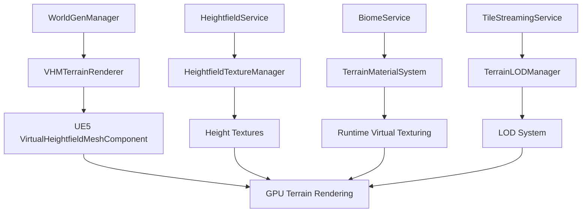

# Design Document

## Overview

The Virtual Heightfield Mesh (VHM) Terrain Rendering system provides the visual layer for the world generation infrastructure by converting heightfield data into rendered terrain meshes. The system leverages UE5's Virtual Heightfield Mesh component and Runtime Virtual Texturing (RVT) to create efficient, scalable terrain rendering that supports real-time modifications, seamless streaming, and biome-based material blending.

## Architecture

### Core Components

The VHM system consists of four primary components:

1. **VHMTerrainRenderer** - Main rendering coordinator that manages VHM components
2. **HeightfieldTextureManager** - Converts heightfield data to GPU textures
3. **TerrainMaterialSystem** - Handles biome-based material blending and RVT integration
4. **TerrainLODManager** - Manages level-of-detail and culling for performance

### Integration Architecture



### Data Flow

1. **Heightfield Generation**: HeightfieldService generates tile height data
2. **Texture Conversion**: HeightfieldTextureManager converts height arrays to GPU textures
3. **VHM Creation**: VHMTerrainRenderer creates VirtualHeightfieldMeshComponent instances
4. **Material Application**: TerrainMaterialSystem applies biome-based materials via RVT
5. **LOD Management**: TerrainLODManager handles distance-based detail levels
6. **Real-time Updates**: Terrain modifications trigger texture and mesh updates

## Components and Interfaces

### VHMTerrainRenderer

**Primary Responsibilities:**
- Coordinate terrain mesh creation and updates
- Manage VirtualHeightfieldMeshComponent lifecycle
- Handle tile-based mesh streaming
- Integrate with existing WorldGenManager

**Key Methods:**
```cpp
class VIBEHEIM_API UVHMTerrainRenderer : public UObject
{
public:
    // Initialize VHM system with world generation services
    bool Initialize(UWorldGenSettings* Settings, UHeightfieldService* HeightfieldSvc);
    
    // Create terrain mesh for a specific tile
    bool CreateTerrainMeshForTile(const FTileCoord& TileCoord);
    
    // Update terrain mesh when heightfield data changes
    bool UpdateTerrainMesh(const FTileCoord& TileCoord, const TArray<FHeightfieldModification>& Modifications);
    
    // Remove terrain mesh when tile is unloaded
    void RemoveTerrainMesh(const FTileCoord& TileCoord);
    
    // Get VHM component for a specific tile
    UVirtualHeightfieldMeshComponent* GetVHMComponent(const FTileCoord& TileCoord);
};
```

### HeightfieldTextureManager

**Primary Responsibilities:**
- Convert heightfield arrays to UE5 texture formats
- Manage texture streaming and memory usage
- Handle real-time texture updates for terrain editing
- Optimize texture formats for GPU performance

**Key Methods:**
```cpp
class VIBEHEIM_API UHeightfieldTextureManager : public UObject
{
public:
    // Create height texture from heightfield data
    UTexture2D* CreateHeightTexture(const FTileCoord& TileCoord, const TArray<float>& HeightData);
    
    // Update existing texture with modified height data
    bool UpdateHeightTexture(const FTileCoord& TileCoord, const TArray<FHeightfieldModification>& Modifications);
    
    // Create normal map texture from height data
    UTexture2D* CreateNormalTexture(const FTileCoord& TileCoord, const TArray<float>& HeightData);
    
    // Manage texture memory and streaming
    void OptimizeTextureMemory();
};
```

### TerrainMaterialSystem

**Primary Responsibilities:**
- Apply biome-specific materials to terrain meshes
- Handle material blending across biome boundaries
- Integrate with Runtime Virtual Texturing for efficient rendering
- Support multiple material layers (base, detail, overlay)

**Key Methods:**
```cpp
class VIBEHEIM_API UTerrainMaterialSystem : public UObject
{
public:
    // Create material instance for a tile based on biome data
    UMaterialInstanceDynamic* CreateTileMaterial(const FTileCoord& TileCoord, const FBiomeData& BiomeData);
    
    // Update material parameters when biome data changes
    bool UpdateMaterialParameters(const FTileCoord& TileCoord, const FBiomeData& BiomeData);
    
    // Handle material blending across tile boundaries
    void BlendMaterialsAcrossTiles(const TArray<FTileCoord>& AdjacentTiles);
    
    // Initialize RVT system for terrain texturing
    bool InitializeRuntimeVirtualTexturing();
};
```

### TerrainLODManager

**Primary Responsibilities:**
- Manage level-of-detail based on camera distance
- Handle terrain mesh culling and visibility
- Optimize performance through adaptive quality settings
- Coordinate with streaming system for efficient loading

**Key Methods:**
```cpp
class VIBEHEIM_API UTerrainLODManager : public UObject
{
public:
    // Calculate appropriate LOD level for tile based on distance
    int32 CalculateLODLevel(const FTileCoord& TileCoord, const FVector& ViewerPosition);
    
    // Update LOD levels for all visible tiles
    void UpdateLODLevels(const FVector& ViewerPosition);
    
    // Handle tile visibility culling
    bool IsTileVisible(const FTileCoord& TileCoord, const FVector& ViewerPosition);
    
    // Optimize mesh detail based on performance requirements
    void OptimizeMeshDetail(float TargetFrameTime);
};
```

## Data Models

### VHM Configuration

```cpp
USTRUCT(BlueprintType)
struct VIBEHEIM_API FVHMSettings
{
    GENERATED_BODY()

    // Texture resolution for height data (64x64 for 64m tiles with 1m spacing)
    UPROPERTY(EditAnywhere, BlueprintReadWrite)
    int32 HeightTextureResolution = 64;
    
    // Number of LOD levels for distance-based quality
    UPROPERTY(EditAnywhere, BlueprintReadWrite)
    int32 LODLevels = 4;
    
    // Maximum viewing distance for terrain rendering
    UPROPERTY(EditAnywhere, BlueprintReadWrite)
    float MaxViewDistance = 2000.0f;
    
    // Enable real-time terrain editing support
    UPROPERTY(EditAnywhere, BlueprintReadWrite)
    bool bEnableRealTimeEditing = true;
    
    // RVT settings for material blending
    UPROPERTY(EditAnywhere, BlueprintReadWrite)
    bool bUseRuntimeVirtualTexturing = true;
};
```

### Terrain Mesh Data

```cpp
USTRUCT(BlueprintType)
struct VIBEHEIM_API FTerrainMeshData
{
    GENERATED_BODY()

    // Tile coordinate this mesh represents
    UPROPERTY()
    FTileCoord TileCoord = FTileCoord();
    
    // VHM component instance
    UPROPERTY()
    TObjectPtr<UVirtualHeightfieldMeshComponent> VHMComponent = nullptr;
    
    // Height texture for this tile
    UPROPERTY()
    TObjectPtr<UTexture2D> HeightTexture = nullptr;
    
    // Material instance for biome-specific rendering
    UPROPERTY()
    TObjectPtr<UMaterialInstanceDynamic> MaterialInstance = nullptr;
    
    // Current LOD level
    UPROPERTY()
    int32 CurrentLODLevel = 0;
    
    // Last update timestamp for cache management
    UPROPERTY()
    double LastUpdateTime = 0.0;
};
```

## Error Handling

### VHM Component Creation Failures

**Texture Creation Errors**
- Fallback to lower resolution textures when GPU memory is limited
- Graceful degradation to placeholder textures for critical failures
- Error logging with specific texture format and size information
- Automatic retry with reduced quality settings

**Material System Errors**
- Default material fallback when biome-specific materials fail to load
- RVT initialization failure handling with standard texturing fallback
- Material parameter validation and safe default value application
- Performance monitoring to detect material system bottlenecks

### Performance Degradation Handling

**Frame Rate Protection**
- Automatic LOD reduction when frame rate drops below targets
- Mesh update batching to prevent frame time spikes
- Texture streaming prioritization based on viewer proximity
- Emergency quality reduction for sustained performance issues

**Memory Management**
- Texture memory monitoring and automatic cleanup
- VHM component pooling to reduce allocation overhead
- Garbage collection coordination for large mesh updates
- Memory pressure detection and proactive resource management

## Testing Strategy

### Automated Testing

**VHM Integration Tests**
- Verify VHM component creation for generated tiles
- Validate texture generation from heightfield data
- Test material application and biome integration
- Performance regression testing for mesh generation times

**Real-time Update Tests**
- Terrain modification visual update validation
- Texture streaming correctness verification
- LOD transition smoothness testing
- Memory leak detection during extended operation

### Visual Quality Testing

**Rendering Correctness**
- Height data accuracy in rendered meshes
- Seamless tile boundary verification
- Material blending quality assessment
- LOD transition visual quality validation

**Performance Benchmarking**
- Frame rate stability during terrain streaming
- Mesh generation time measurement
- Texture memory usage monitoring
- GPU performance impact assessment

### Integration Testing

**World Generation Integration**
- End-to-end terrain generation and rendering workflow
- Persistence system integration with visual updates
- Streaming system coordination with mesh management
- Console command integration for debugging and testing

## Implementation Phases

### Phase 1: Core VHM Infrastructure
- Basic VHMTerrainRenderer implementation
- HeightfieldTextureManager with texture creation
- Integration with existing HeightfieldService
- Simple material application without RVT

### Phase 2: Advanced Rendering Features
- TerrainMaterialSystem with biome-based materials
- Runtime Virtual Texturing integration
- TerrainLODManager with distance-based quality
- Real-time terrain editing visual updates

### Phase 3: Performance Optimization
- Texture streaming and memory management
- Mesh generation performance optimization
- LOD system refinement and tuning
- GPU performance profiling and optimization

### Phase 4: Quality and Polish
- Visual quality improvements and material refinement
- Seamless tile boundary handling
- Advanced debugging and visualization tools
- Comprehensive testing and validation suite