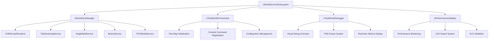

# Design Document

## Overview

The Simple Test World creates a demonstration environment that showcases the integrated VHM terrain rendering and world generation systems. The design leverages the existing WorldGenManager architecture while adding a dedicated test world subsystem for orchestration, comprehensive debugging tools, and performance validation. The system provides a /Game/Maps/WG_TestMap that automatically initializes all world generation systems and provides console-based testing and debugging capabilities.

## Architecture

### Core Components

The test world system extends the existing architecture with dedicated testing and debugging components:



### Integration Architecture

The test world integrates with existing systems through well-defined interfaces:

1. **UWorldGenTestSubsystem** - Main orchestrator using UE5 subsystem pattern
2. **UTestWorldOrchestrator** - Handles test world initialization and lifecycle
3. **UTestWorldDebugger** - Provides visual debugging and export capabilities
4. **UPerformanceValidator** - Monitors and validates performance targets

## Components and Interfaces

### UWorldGenTestSubsystem

**Primary Responsibilities:**
- Orchestrate test world initialization using UWorldSubsystem pattern
- Manage console command registration and lifecycle
- Coordinate between test components and existing world generation systems
- Handle deterministic seed management and configuration

**Key Methods:**
```cpp
class VIBEHEIM_API UWorldGenTestSubsystem : public UWorldSubsystem
{
public:
    // USubsystem interface
    virtual void Initialize(FSubsystemCollectionBase& Collection) override;
    virtual void Deinitialize() override;
    virtual bool ShouldCreateSubsystem(UObject* Outer) const override;

    // Test world management
    UFUNCTION(BlueprintCallable, CallInEditor = true)
    bool LaunchTestWorld();
    
    UFUNCTION(BlueprintCallable, CallInEditor = true)
    void ResetTestWorld();
    
    // Configuration management
    UFUNCTION(BlueprintCallable)
    void SetWorldSeed(uint64 NewSeed);
    
    UFUNCTION(BlueprintCallable)
    void SetStreamingRadii(int32 GenerateRadius, int32 LoadRadius, int32 ActiveRadius);
    
    // Performance validation
    UFUNCTION(BlueprintCallable)
    bool ValidatePerformanceTargets();
    
    // Debug and export functionality
    UFUNCTION(BlueprintCallable)
    void ExportDebugData(const FString& DataType, int32 TileX = 0, int32 TileY = 0);
    
private:
    UPROPERTY()
    TObjectPtr<UTestWorldOrchestrator> TestOrchestrator;
    
    UPROPERTY()
    TObjectPtr<UTestWorldDebugger> TestDebugger;
    
    UPROPERTY()
    TObjectPtr<UPerformanceValidator> PerformanceValidator;
    
    // Console command management
    void RegisterConsoleCommands();
    void UnregisterConsoleCommands();
    TArray<IConsoleObject*> RegisteredCommands;
};
```

### UTestWorldOrchestrator

**Primary Responsibilities:**
- Initialize WorldGenManager and all dependent services
- Manage test world lifecycle and state transitions
- Handle configuration hot-reloading where safe
- Coordinate deterministic world generation

**Key Methods:**
```cpp
class VIBEHEIM_API UTestWorldOrchestrator : public UObject
{
public:
    // Initialization and lifecycle
    bool InitializeTestWorld(UWorld* World);
    void ShutdownTestWorld();
    bool IsTestWorldActive() const;
    
    // Configuration management
    bool LoadConfiguration(const FString& ConfigPath = TEXT(""));
    bool ApplyConfigurationChanges(const FWorldGenConfig& NewConfig);
    bool IsConfigurationChangeSupported(const FString& ParameterName) const;
    
    // World generation control
    bool StartWorldGeneration(uint64 Seed);
    void StopWorldGeneration();
    bool RegenerateWorld(uint64 NewSeed);
    
    // Determinism validation
    bool ValidateDeterministicGeneration(uint64 Seed, int32 NumTilesToTest = 10);
    TArray<uint32> GetTileChecksums(const TArray<FTileCoord>& Tiles);
    
private:
    UPROPERTY()
    TObjectPtr<AWorldGenManager> WorldGenManager;
    
    UPROPERTY()
    FWorldGenConfig CurrentConfig;
    
    UPROPERTY()
    bool bIsInitialized;
    
    // Helper methods
    AWorldGenManager* FindOrCreateWorldGenManager(UWorld* World);
    bool ValidateSystemInitialization();
    void HandleInitializationFailure(const FString& FailedSystem);
};
```

### UTestWorldDebugger

**Primary Responsibilities:**
- Provide visual debugging overlays and information display
- Handle PNG export functionality for height, biome, and climate data
- Manage debug visualization toggles and rendering
- Integrate with existing VHM debug systems

**Key Methods:**
```cpp
class VIBEHEIM_API UTestWorldDebugger : public UObject
{
public:
    // Debug visualization control
    void SetDebugMode(ETestWorldDebugMode DebugMode, bool bEnabled);
    bool IsDebugModeEnabled(ETestWorldDebugMode DebugMode) const;
    void ToggleDebugMode(ETestWorldDebugMode DebugMode);
    
    // Visual overlays
    void ShowTileBoundaries(bool bShow);
    void ShowBiomeOverlay(bool bShow);
    void ShowPCGDebugInfo(bool bShow);
    void ShowPerformanceMetrics(bool bShow);
    
    // Export functionality
    bool ExportHeightData(int32 TileX, int32 TileY, const FString& OutputPath = TEXT(""));
    bool ExportBiomeData(int32 TileX, int32 TileY, const FString& OutputPath = TEXT(""));
    bool ExportClimateData(int32 TileX, int32 TileY, const FString& OutputPath = TEXT(""));
    bool ExportAllDebugData(int32 TileX, int32 TileY, const FString& OutputPath = TEXT(""));
    
    // Real-time metrics display
    void UpdateMetricsDisplay();
    FString GetFormattedMetrics() const;
    
private:
    // Debug state
    TMap<ETestWorldDebugMode, bool> DebugModeStates;
    
    // Export settings
    UPROPERTY()
    FString DefaultExportPath;
    
    UPROPERTY()
    int32 ExportTextureResolution;
    
    // Helper methods
    FString GenerateTimestampedFilename(const FString& BaseName, const FTileCoord& TileCoord) const;
    bool WriteTextureDataToPNG(const TArray<float>& Data, int32 Width, int32 Height, const FString& FilePath);
    void DrawDebugOverlay(UCanvas* Canvas, const FString& DebugText);
};
```

### UPerformanceValidator

**Primary Responsibilities:**
- Monitor real-time performance metrics against defined SLOs
- Track frame time impact during tile streaming and generation
- Export performance data to CSV for analysis
- Validate deterministic generation performance

**Key Methods:**
```cpp
class VIBEHEIM_API UPerformanceValidator : public UObject
{
public:
    // Performance monitoring
    void StartPerformanceSession();
    void EndPerformanceSession();
    bool IsPerformanceSessionActive() const;
    
    // Metrics collection
    void RecordTileGenerationTime(const FTileCoord& TileCoord, float GenerationTimeMs);
    void RecordPCGGenerationTime(const FTileCoord& TileCoord, float PCGTimeMs);
    void RecordFrameTimeSpike(float SpikeTimeMs, const FString& Context);
    void RecordMemoryUsage(float VRAMUsageMB, float RAMUsageMB);
    
    // SLO validation
    bool ValidatePerformanceTargets();
    FPerformanceValidationResult GetValidationResults() const;
    bool AreTargetsMet() const;
    
    // Export and reporting
    bool ExportPerformanceData(const FString& OutputPath = TEXT(""));
    FString GeneratePerformanceReport() const;
    
    // Real-time monitoring
    FPerformanceMetrics GetCurrentMetrics() const;
    float GetAverageFrameTime() const;
    float GetAverageTileGenerationTime() const;
    
private:
    // Performance data storage
    TArray<FTilePerformanceData> TileGenerationData;
    TArray<FFrameTimeData> FrameTimeData;
    TArray<FMemoryUsageData> MemoryUsageData;
    
    // Session management
    double SessionStartTime;
    bool bSessionActive;
    
    // Performance targets (from requirements)
    static constexpr float MaxGameThreadOverheadMs = 0.5f;
    static constexpr float MaxWorkerThreadP50Ms = 10.0f;
    static constexpr float MaxWorkerThreadP95Ms = 20.0f;
    static constexpr float MaxPCGP50Ms = 8.0f;
    static constexpr float MaxPCGP95Ms = 15.0f;
    static constexpr float MaxFrameTimeSpikeMs = 8.0f;
    
    // Helper methods
    void CalculatePercentiles(const TArray<float>& Values, float& OutP50, float& OutP95) const;
    FString FormatTimestamp(double TimeSeconds) const;
    bool WriteCSVData(const FString& FilePath, const TArray<FString>& Headers, const TArray<TArray<FString>>& Rows);
};
```

## Data Models

### Test World Configuration

```cpp
USTRUCT(BlueprintType)
struct VIBEHEIM_API FTestWorldConfig
{
    GENERATED_BODY()

    // Test world settings
    UPROPERTY(EditAnywhere, BlueprintReadWrite)
    FString TestMapPath = TEXT("/Game/Maps/WG_TestMap");
    
    UPROPERTY(EditAnywhere, BlueprintReadWrite)
    uint64 DefaultSeed = 1337;
    
    UPROPERTY(EditAnywhere, BlueprintReadWrite)
    bool bAutoStartGeneration = true;
    
    // Debug settings
    UPROPERTY(EditAnywhere, BlueprintReadWrite)
    FString DefaultExportPath = TEXT("Saved/Vibeheim/WorldGen/Exports/");
    
    UPROPERTY(EditAnywhere, BlueprintReadWrite)
    int32 ExportTextureResolution = 1024;
    
    UPROPERTY(EditAnywhere, BlueprintReadWrite)
    bool bEnablePerformanceMonitoring = true;
    
    // Performance validation settings
    UPROPERTY(EditAnywhere, BlueprintReadWrite)
    int32 DeterminismTestTileCount = 10;
    
    UPROPERTY(EditAnywhere, BlueprintReadWrite)
    float PerformanceSessionDurationMinutes = 5.0f;
    
    UPROPERTY(EditAnywhere, BlueprintReadWrite)
    int32 MinTilesForValidation = 30;
};
```

### Debug Mode Enumeration

```cpp
UENUM(BlueprintType)
enum class ETestWorldDebugMode : uint8
{
    None = 0,
    TileBoundaries = 1,
    BiomeOverlay = 2,
    PCGDebugInfo = 4,
    PerformanceMetrics = 8,
    VHMWireframe = 16,
    ClimateData = 32,
    All = 255
};
ENUM_CLASS_FLAGS(ETestWorldDebugMode);
```

### Performance Data Structures

```cpp
USTRUCT(BlueprintType)
struct VIBEHEIM_API FTilePerformanceData
{
    GENERATED_BODY()

    UPROPERTY()
    FTileCoord TileCoord = FTileCoord();
    
    UPROPERTY()
    double QueuedTime = 0.0;
    
    UPROPERTY()
    double GenerationStartTime = 0.0;
    
    UPROPERTY()
    double GenerationEndTime = 0.0;
    
    UPROPERTY()
    double PCGStartTime = 0.0;
    
    UPROPERTY()
    double PCGEndTime = 0.0;
    
    UPROPERTY()
    double StreamedInTime = 0.0;
    
    UPROPERTY()
    double EvictedTime = 0.0;
    
    UPROPERTY()
    float GameThreadOverheadMs = 0.0f;
    
    UPROPERTY()
    bool bMeetsPerformanceTargets = false;
};

USTRUCT(BlueprintType)
struct VIBEHEIM_API FPerformanceValidationResult
{
    GENERATED_BODY()

    UPROPERTY()
    bool bAllTargetsMet = false;
    
    UPROPERTY()
    float GameThreadOverheadP95 = 0.0f;
    
    UPROPERTY()
    float WorkerThreadP50 = 0.0f;
    
    UPROPERTY()
    float WorkerThreadP95 = 0.0f;
    
    UPROPERTY()
    float PCGP50 = 0.0f;
    
    UPROPERTY()
    float PCGP95 = 0.0f;
    
    UPROPERTY()
    float MaxFrameTimeSpike = 0.0f;
    
    UPROPERTY()
    int32 TotalTilesValidated = 0;
    
    UPROPERTY()
    FString ValidationSummary;
};
```

## Error Handling

### Subsystem Initialization Failures

**WorldGenManager Creation Issues**
- Fallback to creating new WorldGenManager instance if none exists
- Graceful degradation with simplified world generation if services fail
- Clear error logging with specific service failure information
- Automatic retry with reduced feature set for critical failures

**Service Integration Failures**
- Individual service validation with specific error reporting
- Fallback systems for non-critical services (debug, export)
- Safe shutdown procedures when core services fail
- User notification through console output and log files

### Performance Validation Failures

**Target Violation Handling**
- Automatic quality reduction when performance targets are consistently missed
- Warning notifications when approaching performance limits
- Graceful degradation of debug features under performance pressure
- Emergency shutdown of non-essential systems during critical performance issues

**Memory Management**
- Proactive texture memory monitoring and cleanup
- Automatic export path cleanup for disk space management
- Performance data buffer management to prevent memory leaks
- Emergency memory cleanup procedures for low-memory situations

## Testing Strategy

### Automated Validation

**Determinism Testing**
- Automated seed-based generation validation with checksum comparison
- Multi-run consistency testing for identical world generation
- Border seam validation across tile boundaries
- PCG determinism validation for consistent instance placement

**Performance Regression Testing**
- Automated performance benchmark execution
- SLO compliance validation with pass/fail criteria
- Frame time spike detection and reporting
- Memory usage trend analysis and validation

### Integration Testing

**End-to-End Workflow Validation**
- Complete test world initialization and shutdown cycles
- Console command functionality testing
- Export system validation with file integrity checks
- Debug visualization correctness verification

**System Interaction Testing**
- VHM integration with world generation pipeline
- Real-time terrain editing with visual update validation
- Streaming system coordination with performance monitoring
- Persistence system integration with modification round-trip testing

## Implementation Phases

### Phase 1: Core Test World Infrastructure
- UWorldGenTestSubsystem implementation with basic orchestration
- UTestWorldOrchestrator with WorldGenManager integration
- Basic console command registration and test map creation
- Simple performance monitoring and validation framework

### Phase 2: Debug and Visualization Systems
- UTestWorldDebugger with visual overlay capabilities
- PNG export system for height, biome, and climate data
- Debug mode toggles and real-time metrics display
- Integration with existing VHM debug systems

### Phase 3: Performance Validation and Monitoring
- UPerformanceValidator with comprehensive metrics collection
- CSV export system for performance analysis
- SLO validation with automated pass/fail reporting
- Real-time performance monitoring and alerting

### Phase 4: Polish and Documentation
- Console command help system and documentation
- Error handling refinement and user-friendly messaging
- Performance optimization and memory usage improvements
- Comprehensive testing and validation suite completion

## Console Command Implementation

### Core Commands
```cpp
// Test world management
wg.launch - Load test map and initialize systems
wg.seed <value> - Set world generation seed with confirmation
wg.radii <gen> <load> <active> - Configure streaming radii
wg.reset - Clear persistence and regenerate world

// Debug visualization
wg.debug.tiles <0|1> - Toggle tile boundary visualization
wg.debug.biomes <0|1> - Toggle biome overlay display
wg.debug.pcg <0|1> - Toggle PCG debug information
wg.perf <0|1> - Toggle performance metrics display

// Export functionality
wg.export height <x> <y> - Export height data PNG
wg.export biome <x> <y> - Export biome data PNG
wg.export climate <x> <y> - Export climate data PNG
wg.export all <x> <y> - Export all debug data
```

### Performance and Validation Commands
```cpp
// Performance monitoring
wg.perf.start - Begin performance monitoring session
wg.perf.stop - End session and generate report
wg.perf.validate - Check current metrics against SLOs
wg.perf.export [path] - Export performance data to CSV

// Determinism testing
wg.test.determinism <seed> [tiles] - Validate deterministic generation
wg.test.seams <x> <y> - Test tile boundary seam consistency
wg.test.roundtrip - Test terrain edit persistence
```

## Integration with Existing Systems

### WorldGenManager Integration
- Seamless integration with existing AWorldGenManager architecture
- Preservation of all existing functionality and interfaces
- Extension through composition rather than modification
- Backward compatibility with existing console commands and workflows

### VHM System Integration
- Direct integration with UVHMTerrainRenderer for mesh management
- Coordination with UVHMDebugSystem for enhanced debugging
- Real-time update validation for terrain editing workflows
- Performance monitoring integration with VHM metrics

### Streaming System Integration
- Coordination with UTileStreamingService for performance monitoring
- Integration with existing LRU cache and radius-based streaming
- Performance validation of streaming operations and memory usage
- Debug visualization of streaming state and tile lifecycle