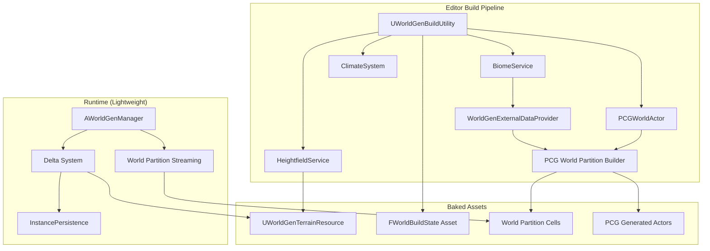
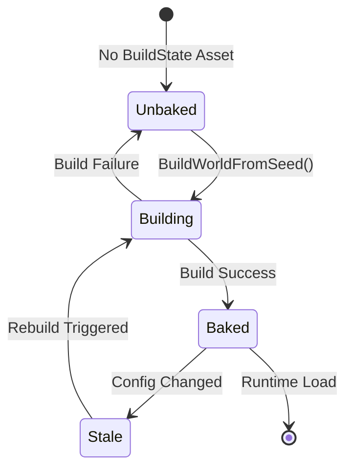
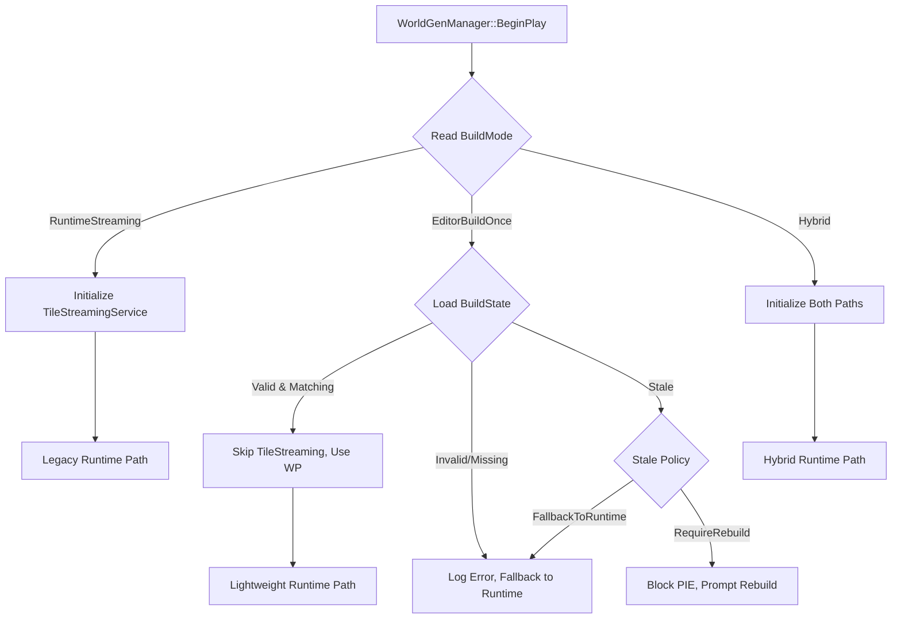

# Editor World Build Pipeline – Design Document

## Overview

This design transforms Vibeheim's world generation from a runtime-centric streaming architecture into a Valheim-style "bake once, then play" model. The core shift moves heavy terrain, biome, and PCG generation into an editor-time build pipeline, leveraging Unreal Engine 5.7's PCG Generation Modes (Partitioned, Hierarchical, Runtime), World Partition integration, and the PCG World Partition Builder for offline generation.

The runtime becomes lightweight: World Partition handles cell streaming of baked content, while the delta system persists only player modifications (buildings, terrain edits).

The editor build pipeline expects a configured `PCGWorldActor` in the map. `BuildWorldFromSeed` ensures it exists and is aligned to `FTileCoord` grid sizing.

## Architecture



## Components and Interfaces

### 1. EWorldGenBuildMode (Enum)

Defines the generation strategy for the world.

```cpp
UENUM(BlueprintType)
enum class EWorldGenBuildMode : uint8
{
    RuntimeStreaming    UMETA(DisplayName = "Runtime Streaming (Legacy)"),
    EditorBuildOnce     UMETA(DisplayName = "Editor Build Once (Valheim-Style)"),
    Hybrid              UMETA(DisplayName = "Hybrid (Baked Terrain + Dynamic Features)")
};
```

### 2. FWorldBuildState (Struct)

Tracks build metadata to validate baked content at runtime.

```cpp
USTRUCT(BlueprintType)
struct VIBEHEIM_API FWorldBuildState
{
    GENERATED_BODY()

    UPROPERTY(VisibleAnywhere, BlueprintReadOnly)
    int32 BuiltSeed = 0;

    UPROPERTY(VisibleAnywhere, BlueprintReadOnly)
    int32 WorldGenVersion = 0;

    UPROPERTY(VisibleAnywhere, BlueprintReadOnly)
    FDateTime LastBuildTime;

    UPROPERTY(VisibleAnywhere, BlueprintReadOnly)
    FString PCGBuildHash;

    UPROPERTY(VisibleAnywhere, BlueprintReadOnly)
    bool bIsBaked = false;

    // Valid if bIsBaked is true, BuiltSeed and WorldGenVersion are non-zero, and PCGBuildHash is non-empty
    bool IsValid() const;
    bool IsCompatibleWith(const FWorldGenConfig& Config) const;
};
```

### 3. UWorldGenBuildStateAsset (UDataAsset)

Persists FWorldBuildState as a companion asset to the map.

```cpp
UCLASS(BlueprintType)
class VIBEHEIM_API UWorldGenBuildStateAsset : public UDataAsset
{
    GENERATED_BODY()

public:
    UPROPERTY(EditAnywhere, BlueprintReadOnly)
    FWorldBuildState BuildState;

    UFUNCTION(BlueprintCallable)
    void UpdateFromBuild(int32 Seed, int32 Version, const FString& PCGHash);
};
```

### 4. UWorldGenTerrainResource (UDataAsset)

Stores prebaked terrain data for runtime consumption.

```cpp
UCLASS(BlueprintType)
class VIBEHEIM_API UWorldGenTerrainResource : public UDataAsset
{
    GENERATED_BODY()

public:
    // Coordinate system metadata (defines FIntPoint → world mapping)
    UPROPERTY(EditAnywhere, BlueprintReadOnly, Category = "Coordinates")
    FVector2D WorldOrigin = FVector2D::ZeroVector; // World-space origin of tile (0,0)

    UPROPERTY(EditAnywhere, BlueprintReadOnly, Category = "Coordinates")
    float TileSizeMeters = 64.0f;

    UPROPERTY(EditAnywhere, BlueprintReadOnly, Category = "Coordinates")
    float SampleSpacingMeters = 1.0f;

    // Global terrain metadata
    UPROPERTY(EditAnywhere, BlueprintReadOnly, Category = "Terrain")
    float MinHeight = 0.0f;

    UPROPERTY(EditAnywhere, BlueprintReadOnly, Category = "Terrain")
    float MaxHeight = 120.0f;

    UPROPERTY(EditAnywhere, BlueprintReadOnly, Category = "Terrain")
    float SeaLevel = 0.0f;

    // Tile-indexed height textures (FIntPoint = tile X,Y coords)
    UPROPERTY(EditAnywhere, BlueprintReadOnly, Category = "Data")
    TMap<FIntPoint, TSoftObjectPtr<UTexture2D>> HeightTextures;

    // Tile-indexed dominant biome data (per tile center)
    UPROPERTY(EditAnywhere, BlueprintReadOnly, Category = "Data")
    TMap<FIntPoint, FBiomeResult> BiomeCache;

    // Query interface
    // Converts WorldPos → tile coords using WorldOrigin and TileSizeMeters,
    // then samples/interpolates from the tile's height texture
    UFUNCTION(BlueprintCallable, Category = "Query")
    float GetHeightAtWorldPosition(const FVector& WorldPos) const;

    UFUNCTION(BlueprintCallable, Category = "Query")
    FBiomeResult GetBiomeAtWorldPosition(const FVector& WorldPos) const;

    UFUNCTION(BlueprintCallable, Category = "Query")
    bool HasTileData(const FTileCoord& Tile) const;

    // Helper to convert world position to tile coordinate (C++ only, not exposed to Blueprint)
    FTileCoord WorldPosToTile(const FVector& WorldPos) const;
};
```


### 5. UWorldGenBuildUtility (Editor-Only UObject)

Orchestrates the editor world build pipeline.

```cpp
UCLASS(BlueprintType)
class VIBEHEIM_API UWorldGenBuildUtility : public UObject
{
    GENERATED_BODY()

public:
    // Main entry point for world building
    // Fails and returns false if called outside an editor, non-PIE context (Property 11)
    UFUNCTION(BlueprintCallable, Category = "WorldGen|Build")
    bool BuildWorldFromSeed(int32 Seed, const FString& MapPath);

    // Progress reporting
    DECLARE_DYNAMIC_MULTICAST_DELEGATE_ThreeParams(FOnBuildProgress, int32, CurrentTile, int32, TotalTiles, const FString&, Status);
    UPROPERTY(BlueprintAssignable)
    FOnBuildProgress OnBuildProgress;

    // Build completion
    DECLARE_DYNAMIC_MULTICAST_DELEGATE_TwoParams(FOnBuildComplete, bool, bSuccess, const FString&, Message);
    UPROPERTY(BlueprintAssignable)
    FOnBuildComplete OnBuildComplete;

private:
    bool InitializeServicesForBuild(UWorld* World, int32 Seed);
    bool BuildTerrainForTile(const FTileCoord& Tile);
    bool TriggerPCGOfflineBuild();
    void SaveBuildState(int32 Seed);
    void CleanupBuild();
};
```

### 6. UWorldGenExternalDataProvider (UObject)

Provides worldgen data to PCG graphs via external data/param data.

```cpp
UCLASS(BlueprintType)
class VIBEHEIM_API UWorldGenExternalDataProvider : public UObject
{
    GENERATED_BODY()

public:
    // Initialize from worldgen services
    void Initialize(UHeightfieldService* HeightService, UBiomeService* BiomeService, UClimateSystem* Climate);

    // Create PCG param data for a tile/cell
    UFUNCTION(BlueprintCallable)
    UPCGParamData* CreateParamDataForCell(const FIntPoint& Cell) const;

    // Query interface for custom PCG nodes
    UFUNCTION(BlueprintCallable)
    float GetTerrainHeight(const FVector& WorldPos) const;

    UFUNCTION(BlueprintCallable)
    FBiomeResult GetBiomeData(const FVector& WorldPos) const;

    UFUNCTION(BlueprintCallable)
    FClimateData GetClimateData(const FVector& WorldPos) const;

private:
    UPROPERTY()
    UHeightfieldService* HeightfieldService;

    UPROPERTY()
    UBiomeService* BiomeService;

    UPROPERTY()
    UClimateSystem* ClimateSystem;
};
```

### 7. FTileCoord Extensions

Add PCG grid conversion helpers to existing FTileCoord. Grid sizes should have an integer ratio for proper alignment.

```cpp
// In WorldGenTypes.h - extend FTileCoord
USTRUCT(BlueprintType)
struct VIBEHEIM_API FTileCoord
{
    // ... existing members ...

    // Convert to PCG partition grid cell
    // Expects TileSize and PCGGridSize to have an integer ratio
    FIntPoint ToPCGGridCell(float PCGGridSize, float TileSize) const;

    // Create from PCG partition grid cell
    // Expects TileSize and PCGGridSize to have an integer ratio
    static FTileCoord FromPCGGridCell(const FIntPoint& Cell, float PCGGridSize, float TileSize);

    // Check if tile aligns with PCG grid (integer ratio relationship)
    // Uses tolerance-based comparison to handle floating-point precision
    static bool IsAlignedWithPCGGrid(float TileSize, float PCGGridSize)
    {
        if (PCGGridSize <= KINDA_SMALL_NUMBER)
        {
            return false;
        }
        const float Ratio = TileSize / PCGGridSize;
        const float Rounded = FMath::RoundToFloat(Ratio);
        return FMath::IsNearlyEqual(Ratio, Rounded, KINDA_SMALL_NUMBER);
    }
};
```

For canonical setups, `TileSizeMeters` should equal `PCGGridSize` or be an integer multiple.

## Data Models

### Build State Flow



### Runtime Mode Decision Tree



### Data Layer Configuration

| Layer Name | Content Type | HLOD Eligible | PCG Graph Target |
|------------|--------------|---------------|------------------|
| TerrainClutter | Grass, small rocks | No | VHM_Biome_* |
| Trees | Trees, large vegetation | Yes | VHM_Biome_Forest |
| Rocks | Boulders, rock formations | Yes | VHM_Biome_Mountains |
| POIs | Points of Interest | Yes | VHM_POI_* |
| Dynamic | Runtime-spawned content | No | Runtime PCG only |


## Correctness Properties

*A property is a characteristic or behavior that should hold true across all valid executions of a system-essentially, a formal statement about what the system should do. Properties serve as the bridge between human-readable specifications and machine-verifiable correctness guarantees.*

### Property 1: Build Mode Determines Streaming Behavior
*For any* WorldGenManager initialization with a given EWorldGenBuildMode, the TileStreamingService activation state shall be deterministically determined by the build mode: active for RuntimeStreaming, inactive for EditorBuildOnce with valid build state, and selectively active for Hybrid.
**Validates: Requirements 1.1, 1.2, 1.3, 1.4**

### Property 2: Build State Persistence Round-Trip
*For any* successful world build with seed S and version V, saving the FWorldBuildState and then loading it shall produce an identical FWorldBuildState with BuiltSeed == S, WorldGenVersion == V, and bIsBaked == true.
**Validates: Requirements 2.1, 2.2**

### Property 3: Seed Mismatch Detection
*For any* FWorldBuildState with BuiltSeed != current FWorldGenConfig.Seed, the system shall detect the mismatch and either fall back to runtime generation or mark the world as stale, never silently using mismatched baked content.
**Validates: Requirements 2.3, 2.4**

### Property 4: Terrain Build Determinism
*For any* seed S and tile coordinate T, calling BuildWorldFromSeed(S) and then querying UWorldGenTerrainResource for tile T shall produce identical height values across multiple builds.
**Validates: Requirements 3.1, 3.2, 11.3**

### Property 5: Prebaked Height Query Consistency
*For any* world position P in a baked world, querying height via UWorldGenTerrainResource::GetHeightAtWorldPosition(P) shall return the same value as was generated during the build, without invoking HeightfieldService::GenerateHeightfield at runtime.
**Validates: Requirements 4.1, 4.2, 4.4, 9.2**

### Property 6: PCG Grid Alignment Round-Trip
*For any* FTileCoord T, converting to PCG grid cell and back via ToPCGGridCell() and FromPCGGridCell() shall produce the original tile coordinate when grid sizes are aligned (integer multiple relationship).
**Validates: Requirements 5.1, 5.2**

### Property 7: PCG External Data Determinism
*For any* PCG graph execution with seed S and cell C, the external data provided by UWorldGenExternalDataProvider shall produce identical PCG output across multiple executions with the same inputs.
**Validates: Requirements 11.1, 11.3, 11.4**

### Property 8: Delta System Isolation
*For any* player modification (terrain edit or structure placement), the modification shall be persisted via the delta system (InstancePersistence or HeightfieldService journal) and shall NOT modify the prebaked UWorldGenTerrainResource or World Partition base content.
**Validates: Requirements 8.1, 8.2, 8.4**

### Property 9: Delta Application Determinism
*For any* baked world with delta set D, loading the world and applying deltas shall produce identical final state across multiple loads, given the same base content and delta set.
**Validates: Requirements 8.3**

### Property 10: Runtime Generation Bypass in Baked Mode
*For any* WorldGenManager in EditorBuildOnce mode with valid build state, the TileStreamingService::UpdateStreaming() shall NOT be called during normal gameplay ticks.
**Validates: Requirements 9.1, 7.2**

### Property 11: Build Context Validation
*For any* attempt to invoke BuildWorldFromSeed() outside of an editor context (e.g., during PIE or in a packaged build), the system shall reject the request and return false without modifying any world state.
**Validates: Requirements 10.5**

## Error Handling

### Build-Time Errors

| Error Condition | Handling Strategy | Recovery |
|-----------------|-------------------|----------|
| Tile generation failure | Log error with tile coords, continue to next tile | Partial build, mark affected tiles |
| PCG graph execution failure | Log graph name and cell, preserve existing content | Skip affected cell, continue build |
| Asset save failure | Log path and error, abort build | Full rollback, no partial state |
| Memory exhaustion | Log warning, reduce batch size | Retry with smaller batches |

### Runtime Errors

| Error Condition | Handling Strategy | Recovery |
|-----------------|-------------------|----------|
| Missing build state | Log warning, fall back to RuntimeStreaming | Graceful degradation |
| Corrupt build state | Log error, treat as unbaked | Fall back or block PIE |
| Missing prebaked tile | Log error, optional runtime fallback | Placeholder or generate on-demand |
| Delta application failure | Log error, skip faulty delta | Continue with base state |

### Error Codes

```cpp
UENUM(BlueprintType)
enum class EWorldBuildError : uint8
{
    None = 0,
    MapLoadFailed,
    ServiceInitFailed,
    TileGenerationFailed,
    PCGBuildFailed,
    AssetSaveFailed,
    BuildStateMissing,
    BuildStateCorrupt,
    SeedMismatch,
    VersionMismatch,
    PrebakedDataMissing,
    DeltaApplicationFailed
};
```


## Testing Strategy

### Dual Testing Approach

This feature requires both unit tests and property-based tests to ensure correctness:

- **Unit tests** verify specific examples, edge cases, and error conditions
- **Property-based tests** verify universal properties that should hold across all inputs

### Property-Based Testing Framework

Property-based testing will be implemented using Unreal's Automation Framework with randomized inputs:

- Each property test will:
  - Generate random seeds, tile coordinates, and world positions within configured bounds
  - Execute the relevant worldgen / build / load paths
  - Assert that the specified property holds (e.g., determinism, delta isolation)
- Each property test should run a minimum of 50–100 iterations to adequately sample the input space
- Generators will use UE Automation Framework helpers for randomized input generation

### Property Test Specifications

| Property | Test Strategy | Generator |
|----------|---------------|-----------|
| Property 1: Build Mode Streaming | Generate random build modes, verify TileStreamingService state | Enum generator for EWorldGenBuildMode |
| Property 2: Build State Round-Trip | Generate random seeds/versions, serialize/deserialize | Int32 range for seed, version |
| Property 3: Seed Mismatch | Generate pairs of seeds, verify detection | Two independent Int32 generators |
| Property 4: Terrain Determinism | Generate random tiles, build twice, compare | FTileCoord generator within world bounds |
| Property 5: Height Query | Generate random world positions, compare prebaked vs expected | FVector generator within terrain bounds |
| Property 6: PCG Grid Round-Trip | Generate random tile coords, convert and back | FTileCoord generator |
| Property 7: PCG External Data | Generate random cells, execute PCG twice, compare | FIntPoint generator for cells |
| Property 8: Delta Isolation | Generate random modifications, verify base unchanged | Modification type + position generator |
| Property 9: Delta Determinism | Generate random delta sets, load twice, compare | Array of modification generators |
| Property 10: Runtime Bypass | Generate random player positions, verify no streaming calls. TileStreamingService exposes a call counter/test hook to assert it was not invoked. | FVector generator for positions |
| Property 11: Build Context | Generate build requests in various contexts | Context enum generator |

### Unit Test Coverage

| Component | Test Focus |
|-----------|------------|
| FWorldBuildState | Serialization, validation, compatibility checks |
| UWorldGenTerrainResource | Height queries, biome queries, tile lookup |
| UWorldGenBuildUtility | Build pipeline stages, error handling |
| UWorldGenExternalDataProvider | Data provisioning, PCG integration |
| FTileCoord extensions | Grid conversion, alignment checks |
| Console commands | Command parsing, execution, output |

### Integration Test Scenarios

1. **Full Build Cycle**: Build world → Save → Load → Verify content
2. **Delta Application**: Build → Modify terrain → Save → Load → Verify deltas applied
3. **Mode Switching**: Switch between RuntimeStreaming and EditorBuildOnce, verify behavior
4. **Stale Detection**: Build → Change seed → Load → Verify stale detection
5. **PCG Integration**: Build with PCG graphs → Verify actors in correct Data Layers

## Console Commands

### Build Commands

| Command | Description | Parameters |
|---------|-------------|------------|
| `wg.build.world` | Trigger full world build | `<seed>` (optional, uses config seed if omitted) |
| `wg.build.status` | Display current build state | None |
| `wg.build.validate` | Verify build state consistency | None |
| `wg.build.terrain` | Build terrain only (no PCG) | `<seed>` |
| `wg.build.pcg` | Build PCG only (requires terrain) | None |

### Debug Commands

| Command | Description | Parameters |
|---------|-------------|------------|
| `wg.build.tile` | Build single tile for testing | `<x> <y>` |
| `wg.build.export` | Export build state to JSON | `<path>` |
| `wg.build.clear` | Clear build state (mark as unbaked) | None |

## File Structure

```
Source/Vibeheim/WorldGen/
├── Public/
│   ├── Data/
│   │   ├── WorldGenTypes.h          # Extended with EWorldGenBuildMode
│   │   └── WorldGenBuildState.h     # NEW: FWorldBuildState struct
│   ├── Editor/
│   │   ├── WorldGenBuildUtility.h   # NEW: Editor build pipeline
│   │   └── WorldGenBuildStateAsset.h # NEW: Build state data asset
│   ├── WorldGenTerrainResource.h    # NEW: Prebaked terrain data asset
│   └── WorldGenExternalDataProvider.h # NEW: PCG external data provider
├── Private/
│   ├── Editor/
│   │   ├── WorldGenBuildUtility.cpp
│   │   └── WorldGenBuildStateAsset.cpp
│   ├── WorldGenTerrainResource.cpp
│   ├── WorldGenExternalDataProvider.cpp
│   ├── WorldGenManager.cpp          # Modified: Mode-aware initialization
│   └── WorldGenConsoleCommands.cpp  # Extended: Build commands
```

## Implementation Notes

### UE 5.7 PCG Integration

- Use the **World Partition PCG Builder** for offline PCG execution:
  - Commandlet: `-run=WorldPartitionBuilderCommandlet -Builder=PCGWorldPartitionBuilder`
  - Console: `pcg.BuildComponents -IncludeGraphNames=...`
- Configure PCG components with partitioned and/or hierarchical generation enabled for world-scale graphs
- Use `UPCGParamData` (and related PCG data types) to feed worldgen data (height, biome, climate, POIs) into PCG graphs via `UWorldGenExternalDataProvider`
- Reserve `UPCGSubsystem::ScheduleGraph()` for:
  - Runtime PCG for small-scope dynamic content
  - Automation tests that need direct control over graph execution

### World Partition Integration

- PCG-generated actors automatically assigned to WP cells via PCG's built-in WP support
- Data Layers configured in Project Settings → World Partition
- HLOD layers configured per Data Layer for distant rendering

### Editor Context Validation

`UWorldGenBuildUtility::BuildWorldFromSeed()` will:
- Check `GIsEditor && !IsRunningGame()` (or equivalent) and fail otherwise
- Return false without modifying any world state if called outside editor context
- This ensures Property 11 (Build Context Validation) is enforced

### Performance Considerations

- Build pipeline processes tiles in batches to manage memory
- Progress reporting uses Slate notifications for editor feedback
- Prebaked height textures use R16F format (matches existing VHM settings)
- Biome cache uses spatial hashing for O(1) lookups
