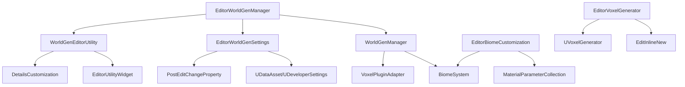

# Editor World Generation Design Document

## Overview

The Editor World Generation system extends the existing world generation infrastructure to provide editor-time tools and workflows. The design focuses on integrating with Unreal Engine's editor systems while maintaining consistency with runtime world generation behavior. The system provides immediate visual feedback, streamlined configuration management, and specialized editor utilities that eliminate the need for PIE mode during world generation iteration.

## Architecture

### Core Components



### Integration Strategy

The design leverages Unreal Engine's editor extension points:

1. **Construction Script Integration**: Override `OnConstruction()` in WorldGenManager for editor-time generation
2. **CallInEditor Functions**: Provide immediate rebuild functionality through details panel buttons
3. **Data Assets**: Replace JSON configuration with UDataAsset or UDeveloperSettings
4. **Editor Utility Widgets**: Create dedicated UI for world generation tools
5. **Details Customization**: Enhance property editing with specialized UI elements

## Components and Interfaces

### EditorWorldGenManager
Extends the existing WorldGenManager with editor-specific functionality.

**Key Features:**
- Editor-time world generation through `OnConstruction()`
- `CallInEditor` functions for immediate terrain rebuilding
- Integration with editor viewport rendering
- Automatic detection of editor vs runtime context

**Key Methods:**
```cpp
UFUNCTION(CallInEditor = true, Category = "World Generation")
void RebuildWorldInEditor();

UFUNCTION(CallInEditor = true, Category = "World Generation") 
void ClearWorldInEditor();

virtual void OnConstruction(const FTransform& Transform) override;
virtual void PostEditChangeProperty(FPropertyChangedEvent& PropertyChangedEvent) override;
```

### EditorWorldGenSettings
Replaces JSON-based configuration with editor-friendly asset management.

**Implementation Options:**

**Option A: UDataAsset Approach**
```cpp
UCLASS(BlueprintType)
class UWorldGenSettingsAsset : public UDataAsset
{
    GENERATED_BODY()
    
public:
    UPROPERTY(EditAnywhere, BlueprintReadOnly, Category = "World Generation")
    FWorldGenSettings Settings;
    
    virtual void PostEditChangeProperty(FPropertyChangedEvent& PropertyChangedEvent) override;
};
```

**Option B: UDeveloperSettings Approach**
```cpp
UCLASS(config = Game, defaultconfig, meta = (DisplayName = "World Generation"))
class UWorldGenDeveloperSettings : public UDeveloperSettings
{
    GENERATED_BODY()
    
public:
    UPROPERTY(config, EditAnywhere, Category = "World Generation")
    FWorldGenSettings Settings;
    
    virtual void PostEditChangeProperty(FPropertyChangedEvent& PropertyChangedEvent) override;
};
```

### WorldGenEditorUtility
Provides specialized editor tools through Editor Utility Widgets.

**Key Features:**
- Real-time generation controls (Build/Rebuild/Clear)
- Live performance metrics display
- Generator and material selection interfaces
- Biome configuration panels
- Progress indicators with cancellation support

**UI Components:**
- Generation control buttons
- Settings property panel
- Performance metrics display
- Generator selection dropdown
- Biome material assignment grid
- Real-time preview controls

### EditorBiomeCustomization
Enhances biome configuration with material and visual customization.

**Enhanced FBiomeData Structure:**
```cpp
struct FBiomeData
{
    FString BiomeName;
    float HeightOffset;
    float NoiseScale;
    float NoiseOctaves;
    TArray<FPOISpawnRule> POIRules;
    
    // New editor-friendly properties
    UPROPERTY(EditAnywhere, Category = "Appearance")
    TSoftObjectPtr<UMaterialInterface> BiomeMaterial;
    
    UPROPERTY(EditAnywhere, Category = "Appearance")
    FLinearColor BiomeColor = FLinearColor::White;
    
    UPROPERTY(EditAnywhere, Category = "Appearance")
    float MaterialBlendSharpness = 1.0f;
    
    FLinearColor DebugColor; // Retained for debug visualization
};
```

### EditorVoxelGenerator
Provides in-editor generator selection and parameter editing.

**Key Features:**
- Dropdown selection of available UVoxelGenerator classes
- `EditInlineNew` support for generator parameter editing
- Automatic detection of custom generator classes
- Preview generation with parameter changes
- Integration with Voxel Graph assets

**Generator Integration:**
```cpp
UPROPERTY(EditAnywhere, Category = "Generation", meta = (EditInlineNew = true))
TSubclassOf<UVoxelGenerator> GeneratorClass;

UPROPERTY(EditAnywhere, Category = "Generation", Instanced)
UVoxelGenerator* GeneratorInstance;
```

## Data Models

### Enhanced FWorldGenSettings
Extended configuration structure with editor-specific properties.

```cpp
struct FWorldGenSettings
{
    // Existing runtime properties
    uint64 Seed = 1337;
    int32 WorldGenVersion = 1;
    FString PluginSHA = "";
    float VoxelSizeCm = 50.0f;
    int32 ChunkSize = 32;
    int32 MaxLOD = 3;
    int32 LOD0Radius = 2;
    int32 LOD1Radius = 4;
    int32 LOD2Radius = 6;
    bool bCollisionUpToLOD1 = true;
    float BiomeBlendMeters = 24.0f;
    int32 SaveFlushMs = 3000;
    
    // Enhanced biome configuration
    TArray<FBiomeData> BiomeConfigurations;
    
    // Editor-specific properties
    UPROPERTY(EditAnywhere, Category = "Editor")
    bool bAutoRebuildOnChange = true;
    
    UPROPERTY(EditAnywhere, Category = "Editor")
    bool bShowDebugVisualization = false;
    
    UPROPERTY(EditAnywhere, Category = "Editor")
    float EditorPreviewRadius = 500.0f;
    
    UPROPERTY(EditAnywhere, Category = "Generation")
    TSoftObjectPtr<UMaterialParameterCollection> BiomeMaterialCollection;
};
```

### EditorGenerationContext
Tracks editor-specific generation state and preferences.

```cpp
struct FEditorGenerationContext
{
    bool bIsEditorGeneration = false;
    float PreviewRadius = 500.0f;
    bool bShowPerformanceMetrics = true;
    bool bEnableProgressCancellation = true;
    TWeakPtr<class SWorldGenProgressWidget> ProgressWidget;
};
```

## Editor Integration Points

### Construction Script Integration
```cpp
void AWorldGenManager::OnConstruction(const FTransform& Transform)
{
    Super::OnConstruction(Transform);
    
#if WITH_EDITOR
    if (GetWorld() && GetWorld()->WorldType == EWorldType::Editor)
    {
        InitializeEditorWorldGeneration();
    }
#endif
}
```

### Property Change Handling
```cpp
void AWorldGenManager::PostEditChangeProperty(FPropertyChangedEvent& PropertyChangedEvent)
{
    Super::PostEditChangeProperty(PropertyChangedEvent);
    
#if WITH_EDITOR
    if (PropertyChangedEvent.Property && 
        PropertyChangedEvent.Property->GetFName() == GET_MEMBER_NAME_CHECKED(AWorldGenManager, WorldGenSettings))
    {
        if (bAutoRebuildOnChange)
        {
            RebuildWorldInEditor();
        }
    }
#endif
}
```

### Details Panel Customization
```cpp
class FWorldGenManagerDetails : public IDetailCustomization
{
public:
    virtual void CustomizeDetails(IDetailLayoutBuilder& DetailBuilder) override;
    
private:
    FReply OnRebuildWorldClicked();
    FReply OnClearWorldClicked();
    TSharedRef<SWidget> CreateGeneratorSelectionWidget();
    TSharedRef<SWidget> CreateBiomeMaterialGrid();
};
```

## Material System Integration

### Biome Material Blending
The system uses Unreal Engine's Material Parameter Collections to dynamically blend biome materials:

```cpp
// Material Parameter Collection setup
UPROPERTY(EditAnywhere, Category = "Materials")
UMaterialParameterCollection* BiomeMaterialCollection;

// Runtime parameter updates
void UpdateBiomeMaterialParameters()
{
    if (BiomeMaterialCollection)
    {
        UKismetMaterialLibrary::SetVectorParameterValue(
            GetWorld(), 
            BiomeMaterialCollection, 
            "MeadowsColor", 
            BiomeConfigurations[0].BiomeColor
        );
        // ... additional biome parameters
    }
}
```

### Master Material Setup
A master material receives biome parameters and blends them based on world position:

- **Biome Mask Sampling**: Sample biome noise masks in material
- **Parameter-Driven Blending**: Use MPC parameters for biome colors/materials
- **Distance-Based LOD**: Adjust material complexity based on distance
- **Editor Preview Support**: Maintain consistency between editor and runtime rendering

## Performance Considerations

### Editor-Specific Optimizations
- **Limited Preview Radius**: Generate only within editor preview bounds
- **Simplified LOD**: Use reduced complexity for editor preview
- **Async Generation**: Maintain editor responsiveness during generation
- **Progress Feedback**: Provide cancellable progress indicators
- **Memory Management**: Clean up editor-only generation data

### Runtime Compatibility
- **Shared Code Paths**: Use same generation logic as runtime
- **Setting Validation**: Ensure editor settings work in runtime
- **Performance Parity**: Match runtime performance characteristics
- **State Consistency**: Maintain consistent world state between editor and runtime

## Error Handling

### Editor-Specific Error Management
- **User-Friendly Messages**: Display clear error messages in editor UI
- **Graceful Degradation**: Fall back to simplified generation on errors
- **Validation Feedback**: Provide immediate feedback on invalid settings
- **Recovery Options**: Offer options to reset or retry failed operations

### Integration Error Handling
- **Plugin Validation**: Verify VoxelPluginLegacy availability in editor
- **Asset Validation**: Check for missing materials or generators
- **Memory Monitoring**: Prevent editor crashes from excessive generation
- **Undo/Redo Support**: Integrate with editor's undo system where possible

## Testing Strategy

### Editor Integration Testing
- **Construction Script Testing**: Verify editor-time generation works correctly
- **Property Change Testing**: Ensure settings changes trigger appropriate updates
- **UI Responsiveness Testing**: Verify editor remains responsive during generation
- **Asset Integration Testing**: Test data asset and developer settings integration

### Visual Consistency Testing
- **Editor/Runtime Parity**: Compare editor preview with runtime generation
- **Material Blending Testing**: Verify biome materials blend correctly in editor
- **Performance Testing**: Ensure editor generation meets performance targets
- **Cross-Platform Testing**: Verify editor tools work on all supported platforms

### User Workflow Testing
- **Designer Workflow Testing**: Test complete designer iteration workflows
- **Error Recovery Testing**: Verify graceful handling of common error scenarios
- **Settings Migration Testing**: Test migration from JSON to new settings system
- **Integration Testing**: Verify compatibility with existing world generation systems

## Migration Strategy

### Existing System Integration
1. **Gradual Migration**: Maintain JSON support during transition period
2. **Setting Conversion**: Provide tools to convert existing JSON settings to new format
3. **Backward Compatibility**: Ensure existing worlds continue to work
4. **Documentation Updates**: Update all documentation to reflect new workflows

### Deployment Considerations
- **Editor Plugin Structure**: Package as editor-only plugin components
- **Runtime Separation**: Ensure editor code doesn't affect shipping builds
- **Asset Dependencies**: Manage dependencies on editor-only assets
- **Version Control**: Consider impact on team workflows and version control