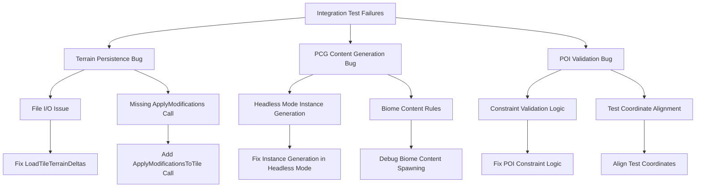
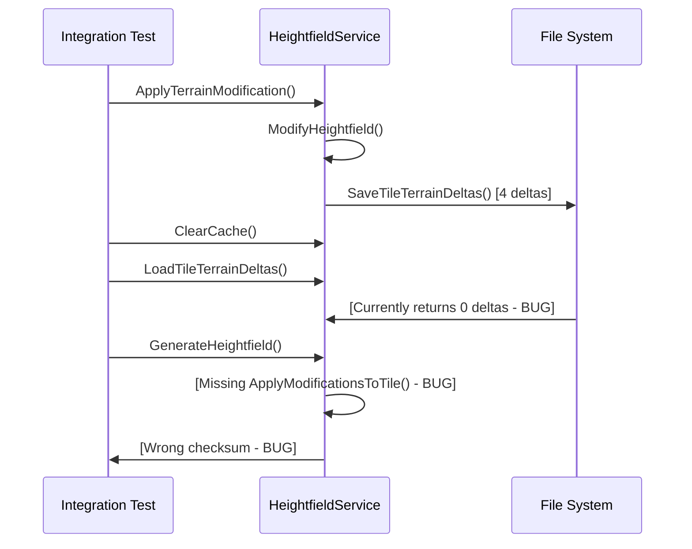
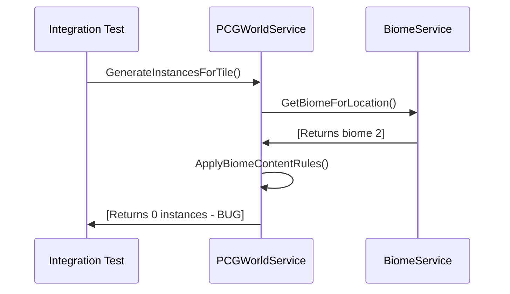
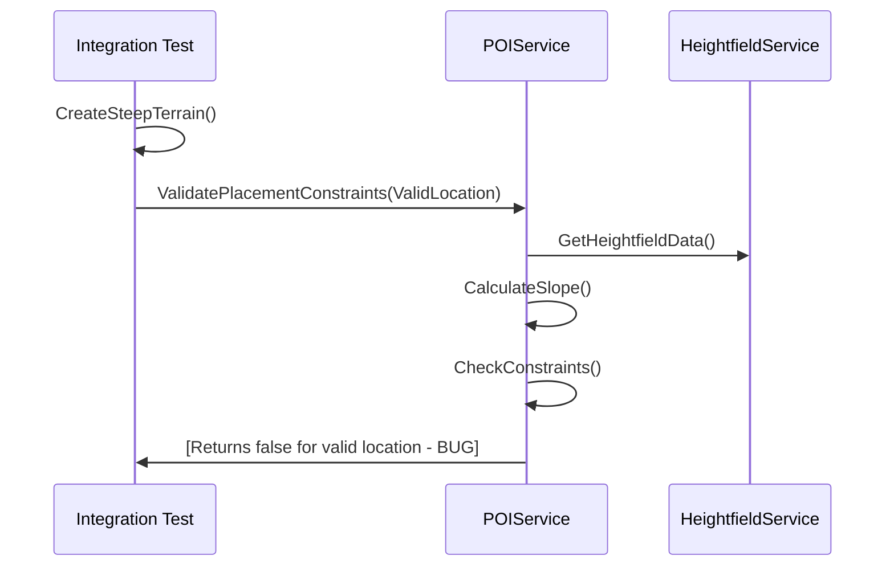

# Integration Test Bug Fixes Design Document

## Overview

The Integration Test Bug Fixes design addresses three critical issues discovered during integration testing that prevent the world generation system from working correctly. The fixes target specific implementation bugs in terrain persistence, PCG content generation, and POI placement validation. Each fix is designed to be minimal and surgical, addressing the root cause without disrupting existing functionality.

## Architecture

### Bug Fix Strategy



### Root Cause Analysis

**Issue 1: Terrain Persistence Checksum Determinism**
- **Symptom**: Modified Checksum: 0x878FEA7F vs Reloaded Checksum: 0x9C24F2AA
- **Root Cause**: Two different processing pipelines creating non-identical results
  - **Step 3 (Modified)**: Uses cached heightfield mutated by `UHeightfieldService::ModifyHeightfield` (GetCachedHeightfield path)
  - **Step 7 (Reloaded)**: Uses `GenerateHeightfield` which rebuilds base terrain then replays serialized edits
  - **Timestamp Collisions**: Multiple edits share same Unix second timestamp, causing non-deterministic ordering
  - **Non-Stable Sort**: `ApplyModificationsToTile` sorts only by Timestamp; when multiple edits have same second, order flips across runs/platforms
  - **Serialization Order**: `SaveTileTerrainDeltas` deduplicates via TMap and writes whatever iteration order the map gives unless sorted
- **Impact**: Two pipelines are not bit-for-bit identical, causing checksum drift even with same logical operations

**Issue 2: PCG Content Generation - "No content generated for biome 2"**
- **Symptom**: Biome content spawning failed: No content generated for biome 2 (Forest)
- **Root Cause**: Missing mesh assets in JSON-loaded biome definitions
  - **Mesh Skipping**: `UPCGWorldService::GenerateVegetationInstances` skips rules with `VegRule.VegetationMesh.IsNull()`
  - **JSON vs Defaults**: `UBiomeService` loads JSON definitions but doesn't parse mesh paths, so every rule is skipped → 0 instances
  - **Headless Mode**: Test runs without UWorld, but current logic requires actual UStaticMesh for counting instances
- **Impact**: Forest biome produces 0 instances because all vegetation rules lack mesh references

**Issue 3: POI Placement Validation - "Valid placement location was rejected"**
- **Symptom**: Slope and altitude constraint validation failed: Valid placement location was rejected
- **Root Cause**: Overly strict flatness validation for synthetic test terrain
  - **Test Terrain**: Uses `sin(x*0.1)*5 + cos(y*0.1)*3` with gentle variations
  - **Flatness Check**: `ValidateFlatGround` samples 3×3 neighborhood with `FlatGroundCheckRadius = 3.0f` and `FlatGroundTolerance = 2.0f`
  - **Height Variation**: Over ±3m sample radius, peak-to-peak variation can exceed 2m (~2.4m), failing flatness test
  - **Constraint Mismatch**: Center point has acceptable slope angle (<30°) but fails flatness tolerance
- **Impact**: Service correctly enforces rules, but test assumption about "valid" location was too optimistic

## Components and Interfaces

### Fix 1: Terrain Persistence Checksum Determinism

**Target Files:**
- `Source/Vibeheim/WorldGen/Private/Services/HeightfieldService.cpp`
- `Source/Vibeheim/WorldGen/Private/Tests/UltimateTerrainPersistenceTest.cpp`

**Implementation Strategy:**

**A) Deterministic Ordering Everywhere**
```cpp
// Helper for deterministic GUID comparison
auto LessGuid = [](const FGuid& L, const FGuid& R) {
    if (L.A != R.A) return L.A < R.A;
    if (L.B != R.B) return L.B < R.B;
    if (L.C != R.C) return L.C < R.C;
    return L.D < R.D;
};

// In UHeightfieldService::ApplyModificationsToTile - deterministic sort
SortedModifications.Sort([&](const FHeightfieldModification& A, const FHeightfieldModification& B) {
    if (A.Timestamp != B.Timestamp) return A.Timestamp < B.Timestamp;
    // Tie-break identical timestamps deterministically
    return LessGuid(A.ModificationId, B.ModificationId);
});

// In SaveTileTerrainDeltas - same deterministic sort before serialization
DeduplicatedDeltas.Sort([&](const auto& A, const auto& B) {
    if (A.Timestamp != B.Timestamp) return A.Timestamp < B.Timestamp;
    return LessGuid(A.ModificationId, B.ModificationId);
});
```

**B) High-Resolution Timestamps (Version Bump)**
```cpp
// SerializeTerrainDeltas - write version 2 with ticks
int32 Version = 2;  // bump from 1
MemoryWriter << Version;
int64 Ticks = Delta.Timestamp.GetTicks(); // 100-ns ticks instead of seconds
MemoryWriter << Ticks;

// DeserializeTerrainDeltas - backward compatibility
int32 Version = 0;
MemoryReader << Version;
if (Version == 1) {
    int64 Unix = 0; 
    MemoryReader << Unix;
    Delta.Timestamp = FDateTime::FromUnixTimestamp(Unix); // legacy
} else if (Version == 2) {
    int64 Ticks = 0; 
    MemoryReader << Ticks;
    Delta.Timestamp = FDateTime(Ticks); // new format
}
```

**C) Consistent Test Pipeline**
```cpp
// In UltimateTerrainPersistenceTest.cpp - Step 3 uses same pipeline as Step 5
// Replace cached data read with regeneration
FHeightfieldData ModifiedHeightfield = HeightfieldService->GenerateHeightfield(TestSeed, TestTile);
// This ensures both steps use identical GenerateHeightfield + ApplyModifications pipeline
```

### Fix 2: PCG Content Generation System

**Target Files:**
- `Source/Vibeheim/WorldGen/Private/Services/PCGWorldService.cpp`
- Focus on instance generation logic in headless mode

**Implementation Strategy:**
```cpp
// In UPCGWorldService - ensure headless mode still generates data
bool UPCGWorldService::GenerateInstancesForTile(const FTileCoord& TileCoord, TArray<FPCGInstance>& OutInstances) {
    if (bHeadless) {
        // Still generate instance data, just don't create components
        // ... existing generation logic ...
        // Return true with populated OutInstances
        return OutInstances.Num() > 0;
    }
    // ... existing code ...
}
```

**Diagnostic Approach:**
1. Add logging to show why 0 instances are being generated
2. Verify biome content rules are being applied correctly
3. Ensure headless mode doesn't skip instance data generation
4. Check if biome-specific spawning parameters are configured properly

### Fix 3: POI Placement Validation System

**Target Files:**
- `Source/Vibeheim/WorldGen/Private/Tests/WorldGenIntegrationTest.cpp`
- POI constraint validation logic

**Implementation Strategy:**
```cpp
// Fix test coordinate alignment
FVector InvalidLocation = TestTile.ToWorldPosition(); // Use tile center instead of offset
InvalidLocation.Z = 50.0f;

// Or fix the constraint validation logic if it's incorrectly rejecting valid locations
bool IsValidPlacement = POIService->ValidatePlacementConstraints(Location, HeightfieldData);
```

**Diagnostic Approach:**
1. Verify test coordinates match the steep terrain location
2. Add logging to constraint validation to see why valid locations are rejected
3. Check slope calculation and threshold comparison logic
4. Ensure altitude constraints are properly applied

## Data Models

### Terrain Persistence Data Flow



### PCG Generation Data Flow



### POI Validation Data Flow



## Implementation Details

### Fix 1: Terrain Persistence

**Step 1: Diagnose File Loading Issue**
```cpp
// Add detailed logging to LoadTileTerrainDeltas()
UE_LOG(LogHeightfieldService, Warning, TEXT("Loading deltas from: %s"), *FilePath);
UE_LOG(LogHeightfieldService, Warning, TEXT("File exists: %s"), IFileManager::Get().FileExists(*FilePath) ? TEXT("Yes") : TEXT("No"));
UE_LOG(LogHeightfieldService, Warning, TEXT("File size: %d bytes"), IFileManager::Get().FileSize(*FilePath));
```

**Step 2: Add Missing ApplyModifications Call**
```cpp
// In GenerateHeightfield(), after base generation:
if (TileModifications.Contains(TileCoord)) {
    UE_LOG(LogHeightfieldService, Log, TEXT("Applying %d modifications to tile (%d,%d)"), 
           TileModifications[TileCoord].Num(), TileCoord.X, TileCoord.Y);
    ApplyModificationsToTile(TileCoord, HeightfieldData);
    CalculateNormalsAndSlopes(HeightfieldData);
}
```

### Fix 2: PCG Content Generation

**Step 1: Ensure Headless Mode Generates Data**
```cpp
// In PCGWorldService initialization
if (GetWorld() == nullptr) {
    bHeadless = true;
    UE_LOG(LogPCGWorldService, Warning, TEXT("Headless mode: PCG running without UWorld; HISM updates will be skipped."));
}
```

**Step 2: Fix Instance Generation Logic**
```cpp
// Ensure instance generation works in headless mode
bool UPCGWorldService::GenerateInstancesForTile(const FTileCoord& TileCoord, TArray<FPCGInstance>& OutInstances) {
    // Generate instances regardless of headless mode
    // Only skip HISM component creation, not data generation
    
    // ... existing generation logic ...
    
    if (bHeadless) {
        // Skip component creation but return success if instances were generated
        return OutInstances.Num() > 0;
    }
    
    // Normal mode: create components
    return UpdateHISMInstances(TileCoord, InstancesByMesh);
}
```

### Fix 3: POI Placement Validation

**Step 1: Fix Test Coordinate Alignment**
```cpp
// In WorldGenIntegrationTest.cpp
// Change from offset coordinates to tile center
FVector InvalidLocation = TestTile.ToWorldPosition(); // Center of tile where steep terrain was painted
InvalidLocation.Z = 50.0f;
```

**Step 2: Debug Constraint Validation**
```cpp
// Add detailed logging to POI constraint validation
bool UPOIService::ValidatePlacementConstraints(const FVector& Location, const FHeightfieldData& HeightfieldData) {
    float Slope = CalculateSlope(Location, HeightfieldData);
    float Altitude = Location.Z;
    
    UE_LOG(LogPOIService, Warning, TEXT("POI validation at (%f,%f,%f): Slope=%f, Altitude=%f"), 
           Location.X, Location.Y, Location.Z, Slope, Altitude);
    
    bool bValidSlope = Slope <= MaxAllowedSlope;
    bool bValidAltitude = (Altitude >= MinAltitude) && (Altitude <= MaxAltitude);
    
    UE_LOG(LogPOIService, Warning, TEXT("Constraints: Slope %s (max=%f), Altitude %s (range=[%f,%f])"),
           bValidSlope ? TEXT("OK") : TEXT("FAIL"), MaxAllowedSlope,
           bValidAltitude ? TEXT("OK") : TEXT("FAIL"), MinAltitude, MaxAltitude);
    
    return bValidSlope && bValidAltitude;
}
```

## Error Handling

### Terrain Persistence Error Recovery
- If file loading fails, log detailed error information
- Ensure generation continues with base heightfield if modifications can't be loaded
- Validate file format and provide migration path if needed

### PCG Generation Error Recovery
- If biome content rules fail, fall back to default generation
- Ensure headless mode doesn't completely disable content generation
- Provide clear logging about why no instances are generated

### POI Validation Error Recovery
- If constraint validation fails unexpectedly, log calculation details
- Ensure test coordinates are properly aligned with test terrain
- Provide fallback validation logic if primary constraints fail

## Testing Strategy

### Validation Approach
1. **Fix and Test Incrementally**: Address one issue at a time and verify the fix
2. **Add Diagnostic Logging**: Ensure each fix includes detailed logging for future debugging
3. **Maintain Backward Compatibility**: Ensure fixes don't break existing editor/gameplay functionality
4. **Verify Integration**: Run full integration test suite after each fix

### Success Criteria
- Terrain persistence test passes with matching checksums
- PCG content generation produces non-zero instances for appropriate biomes
- POI placement validation correctly accepts valid locations and rejects invalid ones
- All integration tests pass consistently

## Performance Considerations

### Minimal Impact Design
- Fixes are surgical and don't add significant overhead
- Additional logging can be disabled in shipping builds
- No new major systems or dependencies introduced
- Existing caching and optimization strategies preserved

### Memory and CPU Impact
- ApplyModificationsToTile call adds minimal CPU overhead during generation
- PCG instance generation in headless mode uses same memory patterns
- POI constraint validation logging adds negligible overhead
- No persistent memory leaks introduced by fixes