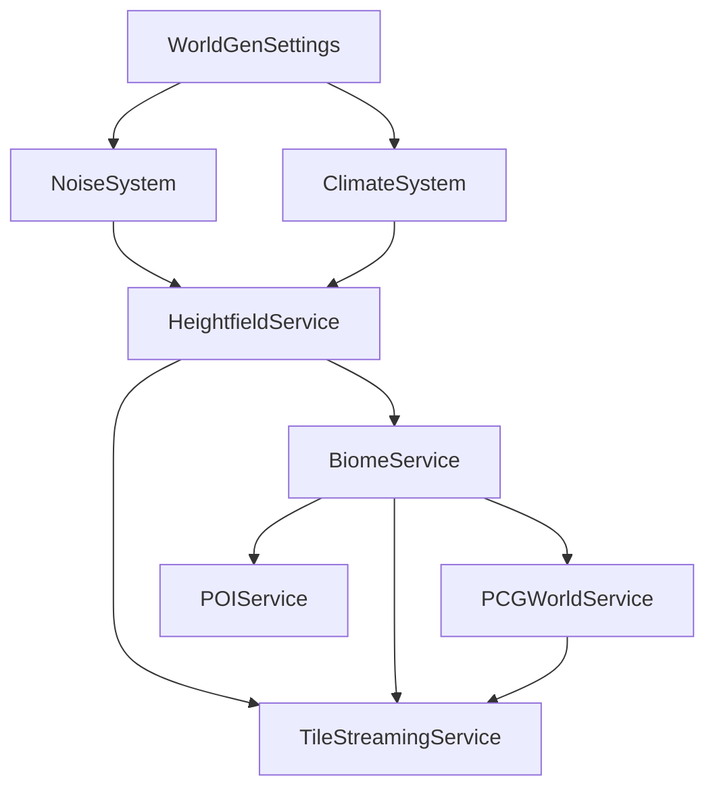

# Integration Test Crash Fix Design Document

## Overview

The Integration Test Crash Fix implements the missing service initialization infrastructure in the `UWorldGenIntegrationTest` class. The design addresses the critical null pointer dereference crash by implementing proper service lifecycle management, dependency injection, and error handling. The solution ensures that all world generation services are properly created, initialized, and configured before any tests attempt to use them.

## Architecture

### Service Initialization Flow

```mermaid
graph TB
    A[ExecuteIntegrationTest] --> B[Initialize]
    B --> C[CreateTempDirectory]
    B --> D[CreateServiceInstances]
    B --> E[InitializeServices]
    B --> F[ValidateTestEnvironment]
    
    D --> G[Create WorldGenSettings]
    D --> H[Create NoiseSystem]
    D --> I[Create ClimateSystem]
    D --> J[Create HeightfieldService]
    D --> K[Create BiomeService]
    D --> L[Create PCGWorldService]
    D --> M[Create POIService]
    D --> N[Create TileStreamingService]
    
    E --> O[Initialize NoiseSystem]
    E --> P[Initialize ClimateSystem]
    E --> Q[Initialize HeightfieldService]
    E --> R[Initialize BiomeService]
    E --> S[Initialize PCGWorldService]
    E --> T[Initialize POIService]
    E --> U[Initialize TileStreamingService]
    
    F --> V[Validate Service Pointers]
    F --> W[Validate Configuration]
    F --> X[Validate File System Access]
```



### Error Handling Strategy

1. **Early Validation**: Check service initialization before running any tests
2. **Graceful Degradation**: Continue with available services when possible
3. **Detailed Logging**: Provide specific error messages for debugging
4. **Resource Cleanup**: Ensure proper cleanup even on failure
5. **State Restoration**: Reset system state after test completion

## Components and Interfaces

### Service Lifecycle Management

The integration test manages the complete lifecycle of world generation services:

**Service Creation Phase**:
- Create UObject instances using `NewObject<T>()`
- Set up proper object ownership and garbage collection
- Initialize service-specific default values

**Service Initialization Phase**:
- Load WorldGenSettings from configuration
- Initialize services in dependency order
- Configure service cross-references and dependencies
- Validate initialization success

**Service Validation Phase**:
- Verify all service pointers are non-null
- Check service initialization status
- Validate configuration consistency
- Test basic service functionality

### Configuration Management

The test system uses a layered configuration approach:

```cpp
struct FIntegrationTestConfig {
    // Base WorldGen configuration
    FWorldGenConfig WorldGenConfig;
    
    // Test-specific overrides
    FTestConfiguration TestConfig;
    
    // Temporary paths and settings
    FString TempDataPath;
    bool bCleanupOnCompletion = true;
    bool bValidatePerformance = true;
};
```

### Error Recovery System

The design implements comprehensive error recovery:

**Service Creation Failures**:
- Log specific service creation errors
- Continue with available services where possible
- Provide fallback implementations for non-critical services
- Report missing dependencies clearly

**Initialization Failures**:
- Retry initialization with default settings
- Skip dependent services if prerequisites fail
- Maintain detailed error logs for debugging
- Provide actionable error messages

## Data Models

### Service Initialization Status

```cpp
struct FServiceInitializationStatus {
    bool bWorldGenSettingsLoaded = false;
    bool bNoiseSystemInitialized = false;
    bool bClimateSystemInitialized = false;
    bool bHeightfieldServiceInitialized = false;
    bool bBiomeServiceInitialized = false;
    bool bPCGServiceInitialized = false;
    bool bPOIServiceInitialized = false;
    bool bTileStreamingServiceInitialized = false;
    
    TArray<FString> InitializationErrors;
    TMap<FString, float> InitializationTimes;
    
    bool IsFullyInitialized() const {
        return bWorldGenSettingsLoaded && bNoiseSystemInitialized && 
               bClimateSystemInitialized && bHeightfieldServiceInitialized &&
               bBiomeServiceInitialized && bPCGServiceInitialized &&
               bPOIServiceInitialized && bTileStreamingServiceInitialized;
    }
};
```

### Test Environment Validation

```cpp
struct FTestEnvironmentValidation {
    bool bTempDirectoryAccessible = false;
    bool bConfigurationValid = false;
    bool bServicesInitialized = false;
    bool bDependenciesResolved = false;
    
    TArray<FString> ValidationErrors;
    TArray<FString> ValidationWarnings;
    
    bool IsEnvironmentValid() const {
        return bTempDirectoryAccessible && bConfigurationValid && 
               bServicesInitialized && bDependenciesResolved;
    }
};
```

## Implementation Strategy

### Phase 1: Core Infrastructure
1. Implement `Initialize()` method with proper error handling
2. Create `CreateTempDirectory()` and `RemoveTempDirectory()` methods
3. Add basic logging and error reporting infrastructure
4. Implement `CleanupTestData()` for resource management

### Phase 2: Service Management
1. Implement `CreateServiceInstances()` with proper UObject creation
2. Add `InitializeServices()` with dependency resolution
3. Create `ValidateTestEnvironment()` for pre-test validation
4. Implement `CleanupServiceInstances()` for proper cleanup

### Phase 3: Error Handling
1. Add `HandleTestFailure()` for detailed error reporting
2. Implement `RestoreSystemState()` for state cleanup
3. Create comprehensive validation methods
4. Add performance monitoring and timeout handling

### Phase 4: Integration
1. Update existing test methods to use initialized services
2. Add proper error checking in all test categories
3. Implement graceful degradation for missing services
4. Add comprehensive logging throughout the test suite

## Service Dependency Resolution

The services must be initialized in the correct order to resolve dependencies:



**Initialization Order**:
1. WorldGenSettings (configuration foundation)
2. NoiseSystem (provides noise generation)
3. ClimateSystem (provides climate calculations)
4. HeightfieldService (depends on noise and climate)
5. BiomeService (depends on heightfield and climate)
6. PCGWorldService (depends on biome data)
7. POIService (depends on biome and heightfield)
8. TileStreamingService (depends on heightfield, biome, and PCG)

## Error Handling Patterns

### Service Creation Pattern
```cpp
template<typename ServiceType>
ServiceType* CreateAndValidateService(const FString& ServiceName) {
    ServiceType* Service = NewObject<ServiceType>(this);
    if (!Service) {
        ValidationData.InitializationErrors.Add(
            FString::Printf(TEXT("Failed to create %s"), *ServiceName));
        return nullptr;
    }
    return Service;
}
```

### Service Initialization Pattern
```cpp
bool InitializeServiceWithValidation(UObject* Service, const FString& ServiceName) {
    if (!Service) {
        ValidationData.InitializationErrors.Add(
            FString::Printf(TEXT("%s is null, cannot initialize"), *ServiceName));
        return false;
    }
    
    double StartTime = FPlatformTime::Seconds();
    bool bSuccess = InitializeSpecificService(Service);
    double EndTime = FPlatformTime::Seconds();
    
    ValidationData.InitializationTimes.Add(ServiceName, (EndTime - StartTime) * 1000.0f);
    
    if (!bSuccess) {
        ValidationData.InitializationErrors.Add(
            FString::Printf(TEXT("Failed to initialize %s"), *ServiceName));
    }
    
    return bSuccess;
}
```

### Defensive Programming Pattern for UTileStreamingService
```cpp
// Inside UTileStreamingService methods
bool UTileStreamingService::GenerateSingleTile(const FTileCoordinate& TileCoord) {
    ensureMsgf(HeightfieldService != nullptr, 
        TEXT("UTileStreamingService: HeightfieldService is null. Call Initialize() before using GenerateSingleTile()."));
    ensureMsgf(BiomeService != nullptr, 
        TEXT("UTileStreamingService: BiomeService is null. Call Initialize() before using GenerateSingleTile()."));
    ensureMsgf(PCGService != nullptr, 
        TEXT("UTileStreamingService: PCGService is null. Call Initialize() before using GenerateSingleTile()."));
    ensureMsgf(WorldGenSettings != nullptr, 
        TEXT("UTileStreamingService: WorldGenSettings is null. Call Initialize() before using GenerateSingleTile()."));
    
    if (!HeightfieldService || !BiomeService || !PCGService || !WorldGenSettings) {
        UE_LOG(LogWorldGen, Error, TEXT("UTileStreamingService::GenerateSingleTile failed - missing required services"));
        return false;
    }
    
    // Proceed with tile generation...
}
```

## Performance Considerations

### Memory Management
- Use proper UObject lifecycle management
- Implement garbage collection-safe patterns
- Clean up temporary objects and data
- Monitor memory usage during tests

### Initialization Performance
- Initialize services in parallel where possible
- Cache initialization results
- Use lazy initialization for non-critical services
- Monitor and report initialization times

### Error Recovery Performance
- Implement fast-fail patterns for critical errors
- Use timeout mechanisms for long-running operations
- Provide early exit strategies for test failures
- Minimize resource usage during error states

## Integration with Existing Systems

### Console Command Integration
The fixed integration test maintains compatibility with existing console commands:
- `wg.IntegrationTest` - Full test suite execution
- Individual test commands remain functional
- Error reporting follows existing logging patterns

### Logging Integration
- Uses existing WorldGen logging categories
- Maintains consistent log message formatting
- Integrates with performance monitoring systems
- Provides detailed debug information

### File System Integration
- Uses existing temporary directory patterns
- Respects existing file naming conventions
- Integrates with existing save/load systems
- Handles file system errors gracefully

## Testing and Validation

### Unit Test Coverage
- Service creation and initialization
- Error handling and recovery
- Configuration loading and validation
- Cleanup and state restoration

### Integration Test Coverage
- End-to-end service initialization
- Cross-service dependency resolution
- Error propagation and handling
- Performance and memory validation

### Regression Test Coverage
- Crash reproduction and prevention
- Service lifecycle management
- Configuration compatibility
- Error message consistency