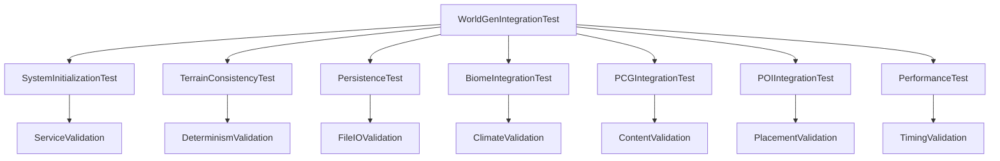

# Integration Test Fix Design Document

## Overview

The Integration Test Fix implements a comprehensive automated testing system for the World Generation framework. The system provides a single console command `wg.IntegrationTest` that executes 7 distinct test categories to validate all aspects of world generation functionality. The design focuses on creating a robust test framework that can identify specific integration failures and provide actionable debugging information.

## Architecture

### Core Components



### Test Execution Flow

1. **Test Initialization**: Setup test environment and temporary data
2. **Sequential Test Execution**: Run each test category in dependency order
3. **Result Aggregation**: Collect pass/fail status and detailed error information
4. **Cleanup**: Remove temporary test data and restore system state
5. **Report Generation**: Display comprehensive test results with debugging info

## Components and Interfaces

### IWorldGenIntegrationTest
Main interface for the integration test system.

**Key Methods:**
- `ExecuteIntegrationTest()`: Run complete test suite and return results
- `ExecuteTestCategory(ETestCategory Category)`: Run specific test category
- `GetTestResults()`: Retrieve detailed test results and error information
- `CleanupTestData()`: Remove temporary test files and restore state

### FIntegrationTestResult
Data structure containing test execution results.

```cpp
struct FIntegrationTestResult {
    bool bPassed = false;
    FString TestName;
    FString ErrorMessage;
    float ExecutionTimeMs = 0.0f;
    TMap<FString, FString> DetailedInfo;
};

struct FIntegrationTestSuite {
    TArray<FIntegrationTestResult> TestResults;
    int32 PassedTests = 0;
    int32 TotalTests = 0;
    float TotalExecutionTimeMs = 0.0f;
    bool bAllTestsPassed = false;
};
```

### UWorldGenIntegrationTest
Main test execution class that coordinates all test categories.

**Key Methods:**
- `Initialize()`: Setup test environment and create temporary directories
- `RunSystemInitializationTest()`: Test 1 - Validate all services initialize correctly
- `RunTerrainConsistencyTest()`: Test 2 - Validate deterministic terrain generation
- `RunPersistenceTest()`: Test 3 - Validate terrain editing and file persistence
- `RunBiomeIntegrationTest()`: Test 4 - Validate biome system integration
- `RunPCGIntegrationTest()`: Test 5 - Validate PCG content generation
- `RunPOIIntegrationTest()`: Test 6 - Validate POI placement and stamping
- `RunPerformanceTest()`: Test 7 - Validate performance meets targets

## Data Models

### FTestConfiguration
Configuration structure for integration test parameters.

```cpp
struct FTestConfiguration {
    uint64 TestSeed = 12345;
    FTileCoord TestTileCoord = FTileCoord(0, 0);
    FString TempDataPath = TEXT("Temp/IntegrationTest/");
    
    // Performance thresholds
    float MaxTileGenTimeMs = 5.0f;  // Slightly higher than target for test tolerance
    float MaxPCGGenTimeMs = 2.0f;
    
    // Test data sizes
    int32 ConsistencyTestIterations = 3;
    int32 PerformanceTestTiles = 5;
    
    // Terrain editing test parameters
    float TerrainEditRadius = 10.0f;
    float TerrainEditStrength = 5.0f;
};
```

### FSystemValidationData
Data structure for tracking service initialization status.

```cpp
struct FSystemValidationData {
    bool bWorldGenSettingsValid = false;
    bool bNoiseSystemValid = false;
    bool bClimateSystemValid = false;
    bool bHeightfieldServiceValid = false;
    bool bBiomeServiceValid = false;
    bool bPCGServiceValid = false;
    bool bPOIServiceValid = false;
    bool bTileStreamingServiceValid = false;
    
    TArray<FString> InitializationErrors;
    TMap<FString, float> ServiceInitTimes;
};
```

## Test Implementation Details

### Test 1: System Initialization
**Purpose**: Validate all world generation services initialize correctly
**Implementation**:
- Create instances of all core services
- Initialize each service with test configuration
- Validate service dependencies are properly set
- Check for initialization errors and timing issues
- Verify settings loading and validation

### Test 2: Terrain Generation Consistency
**Purpose**: Ensure deterministic terrain generation
**Implementation**:
- Generate the same tile multiple times with identical seed
- Compare heightfield data arrays for exact matches
- Validate tile checksums are identical
- Test border consistency between adjacent tiles
- Verify noise system determinism

### Test 3: Terrain Editing and Persistence
**Purpose**: Validate terrain modifications are saved and restored
**Implementation**:
- Generate a test tile with initial heightfield
- Apply all 4 terrain editing operations (Add/Subtract/Flatten/Smooth)
- Save terrain modifications to disk
- Clear in-memory data and reload from disk
- Verify modifications persist correctly
- Test vegetation clearing integration

### Test 4: Biome System Integration
**Purpose**: Ensure biomes are determined correctly based on climate
**Implementation**:
- Generate climate data for test locations
- Validate biome determination logic
- Test biome transitions and blending
- Verify biome-specific content rules
- Check climate calculation consistency

### Test 5: PCG Content Generation
**Purpose**: Validate PCG system generates content properly
**Implementation**:
- Generate PCG content for different biomes
- Verify deterministic instance placement
- Test HISM performance and memory usage
- Validate add/remove operations
- Check PCG fallback systems

### Test 6: POI Generation and Placement
**Purpose**: Ensure POI placement works correctly
**Implementation**:
- Generate POIs using stratified sampling
- Validate placement constraints (slope, altitude, spacing)
- Test terrain stamping around POIs
- Verify POI persistence and modification tracking
- Check biome-specific POI rules

### Test 7: Performance Validation
**Purpose**: Ensure system meets performance targets
**Implementation**:
- Measure tile generation times across multiple tiles
- Monitor PCG generation performance
- Track memory usage during generation
- Validate streaming performance
- Report timing violations and bottlenecks

## Error Handling

### Test Failure Recovery
- Each test category is isolated to prevent cascade failures
- Temporary test data is cleaned up even on test failures
- Detailed error logging with context information
- Graceful degradation when services are unavailable

### Performance Issue Detection
- Timing thresholds with tolerance margins
- Memory usage monitoring and leak detection
- Performance regression detection
- Bottleneck identification and reporting

### File System Error Handling
- Temporary directory creation and cleanup
- File permission validation
- Disk space availability checks
- Atomic file operations for test data

## Integration with Existing Systems

### Console Command Integration
- Implements `wg.IntegrationTest` console command
- Provides detailed output matching expected format
- Integrates with existing logging system
- Uses WorldGen logging categories

### Service Integration
- Uses existing service interfaces and implementations
- Respects service initialization patterns
- Integrates with performance monitoring systems
- Uses existing configuration and settings systems

### File System Integration
- Uses existing persistence patterns for terrain and instances
- Respects existing file naming conventions
- Integrates with existing save/load systems
- Uses temporary directories for test isolation

## Debug and Development Tools

### Test Output Format
```
=== WORLD GENERATION INTEGRATION TEST ===
--- Test 1: System Initialization ---
✓ All services initialized successfully
--- Test 2: Terrain Generation Consistency ---
✓ Terrain generation is deterministic
--- Test 3: Terrain Editing and Persistence ---
✗ Terrain modifications failed to persist
  Error: Failed to save terrain delta file
--- Test 4: Biome System Integration ---
✓ Biome determination working correctly
--- Test 5: PCG Content Generation ---
✓ PCG content generates properly
--- Test 6: POI Generation and Placement ---
✗ POI placement constraint validation failed
  Error: POI placed on invalid slope
--- Test 7: Performance Validation ---
✓ Performance meets target requirements
=== INTEGRATION TEST RESULTS ===
Tests Passed: 5/7
✗ SOME INTEGRATION TESTS FAILED
Error: System requires fixes before gameplay testing
```

### Individual Test Commands
- `wg.TestSystemInit`: Run only system initialization test
- `wg.TestTerrain`: Run only terrain consistency test
- `wg.TestPersistence`: Run only persistence test
- `wg.TestBiomes`: Run only biome integration test
- `wg.TestPCG`: Run only PCG integration test
- `wg.TestPOIs`: Run only POI integration test
- `wg.TestPerformance`: Run only performance test

### Detailed Logging
- Per-test execution timing
- Service initialization details
- File I/O operation results
- Performance metrics and thresholds
- Error context and stack traces