# Valheim-Style World Generation Design Document

## Overview

The Valheim-Style World Generation system extends the existing MVP world generation foundation to create an authentic Valheim-inspired world with macro continental topology, biome ring progression, comprehensive water systems, rivers/lakes, and enhanced PCG content generation. This design builds upon the proven architecture of WorldGenManager, HeightfieldService, BiomeService, and TileStreamingService while adding new services and capabilities to achieve Valheim-level world complexity and authenticity.

## Architecture

### Enhanced System Architecture

```mermaid
graph TB
    A[WorldGenManager] --> B[MacroTopologyService]
    A --> C[EnhancedHeightfieldService]
    A --> D[BiomeRingService]
    A --> E[WaterSystemService]
    A --> F[RiverFlowService]
    A --> G[EnhancedPCGService]
    A --> H[GlobalPOIService]
    A --> I[TerrainStampingService]
    A --> J[AsyncGenerationPipeline]
    
    B --> K[ContinentalNoise]
    B --> L[IslandFalloff]
    C --> M[ExistingHeightfield]
    C --> N[MacroBlending]
    D --> O[RingCalculation]
    D --> P[BiomeProgression]
    E --> Q[WaterBodies]
    E --> R[ShorelineDetection]
    F --> S[FlowComputation]
    F --> T[RiverCarving]
    G --> U[PCGGraphs]
    G --> V[ClusterGeneration]
    H --> W[BlueNoiseSampling]
    H --> X[GlobalReservation]
    I --> Y[VegetationClearing]
    I --> Z[TerrainFlattening]
    J --> AA[WorkQueue]
    J --> BB[BudgetManagement]
```



### Service Integration Layers

1. **Macro Generation Layer**: MacroTopologyService, BiomeRingService handle world-scale features
2. **Enhanced Generation Layer**: Enhanced existing services with new capabilities
3. **Water Systems Layer**: WaterSystemService, RiverFlowService manage all water features
4. **Content Generation Layer**: EnhancedPCGService, GlobalPOIService, TerrainStampingService
5. **Performance Layer**: AsyncGenerationPipeline manages time-sliced generation
6. **Existing Foundation**: Leverages WorldGenManager, TileStreamingService, VHMTerrainRenderer

## Components and Interfaces

### IMacroTopologyService
Manages continental-scale terrain shaping and topology.

**Key Methods:**
- `Initialize(FMacroWorldConfig Config)`: Configure continental parameters
- `GenerateContinentalNoise(FVector2D WorldPos, int32 Seed)`: Create large-scale landmass patterns
- `CalculateIslandFalloff(FVector2D WorldPos, float WorldRadius)`: Apply radial distance falloff
- `BlendMacroTopology(float BaseHeight, FVector2D WorldPos)`: Integrate macro features with base terrain
- `GetCoastalDistance(FVector2D WorldPos)`: Calculate distance to nearest coastline

### IBiomeRingService
Handles Valheim-style biome ring progression and distance-based biome selection.

**Key Methods:**
- `Initialize(TArray<FBiomeRingDefinition> RingConfig)`: Setup ring configuration
- `CalculateRingBias(FVector2D WorldPos, float DistanceFromCenter)`: Determine ring influence
- `GetBiomeForRing(float RadialDistance, FClimateData Climate)`: Select biome based on ring position
- `BlendRingTransitions(FVector2D WorldPos, TMap<EBiomeType, float> Weights)`: Smooth ring boundaries
- `ValidateRingProgression(FTileCoord Tile)`: Ensure monotonic ring progression

### IWaterSystemService
Manages water body spawning, shoreline detection, and water-terrain integration.

**Key Methods:**
- `Initialize(FWaterSystemConfig Config, UTileStreamingService* StreamingService)`: Setup water system
- `SpawnWaterBodiesForTile(FTileCoord Tile, const FHeightfieldData& HeightData)`: Create water features
- `DetectShorelines(const FHeightfieldData& HeightData)`: Identify coastlines and water boundaries
- `GenerateShorelineFoam(FVector2D ShorelinePos, FVector2D Normal)`: Create coastal effects
- `UpdateWaterMask(FTileCoord Tile, TArray<float>& WaterMask)`: Generate water distance data

### IRiverFlowService
Handles river and lake generation through flow computation and terrain carving.

**Key Methods:**
- `Initialize(FRiverSystemConfig Config)`: Configure river generation parameters
- `ComputeFlowMap(FTileCoord CenterTile, int32 NeighborhoodRadius)`: Calculate flow directions
- `CarveRiverChannels(FHeightfieldData& HeightData, const FFlowMap& FlowData)`: Modify terrain for rivers
- `PlaceLakes(FTileCoord Tile, const FHeightfieldData& HeightData)`: Identify and create lake features
- `GenerateWaterSplines(const FFlowMap& FlowData)`: Create spline-based water features

### IEnhancedPCGService
Extends existing PCG service with real PCG graph integration and advanced content generation.

**Key Methods:**
- `InitializePCGGraphs(TMap<EBiomeType, UPCGGraph*> BiomeGraphs)`: Setup biome-specific PCG graphs
- `GenerateClusteredContent(FTileCoord Tile, FPCGClusterParams Params)`: Create vegetation clusters
- `SpawnRoadsAndPaths(FTileCoord Tile, TArray<FVector> POILocations)`: Generate connecting paths
- `ApplyTerrainAwareRules(FPCGGenerationContext Context)`: Use slope, water distance for placement
- `ReconcileWithStamping(FTileCoord Tile, TArray<FStampOperation> Stamps)`: Integrate with terrain modifications

### IGlobalPOIService
Manages world-scale POI placement with uniqueness and proper spacing.

**Key Methods:**
- `Initialize(FGlobalPOIConfig Config)`: Setup global POI management
- `GenerateBlueNoiseSampling(float WorldRadius, float MinDistance)`: Create global sampling pattern
- `ReservePOILocation(FVector Location, float ReservationRadius, FString POIType)`: Reserve multi-tile areas
- `ValidateGlobalSpacing(FVector ProposedLocation, FString POIType)`: Check minimum distance constraints
- `PersistGlobalPOIState()`: Save world-scale POI data across sessions

### ITerrainStampingService
Provides comprehensive terrain modification tools for POI integration.

**Key Methods:**
- `Initialize()`: Setup stamping operations
- `ClearVegetationInArea(FVector Center, float Radius, FTileCoord AffectedTile)`: Remove vegetation for structures
- `FlattenTerrainPad(FVector Center, float Radius, float TargetHeight)`: Create building foundations
- `CreateRampPath(FVector StartPos, FVector EndPos, float Width)`: Generate sloped paths between points
- `StampTerrainPattern(FVector Location, UTexture2D* HeightStamp, float Intensity)`: Apply custom terrain stamps

### IAsyncGenerationPipeline
Manages time-sliced generation with budgets and work queues.

**Key Methods:**
- `Initialize(FAsyncPipelineConfig Config)`: Setup async generation system
- `ScheduleTileGeneration(FTileCoord Tile, EPipelineStage StartStage)`: Queue tile for generation
- `ProcessWorkQueue(float BudgetMs)`: Execute queued work within time budget
- `PrefetchTiles(FTileCoord PlayerTile, int32 PrefetchRings)`: Predictively generate upcoming tiles
- `GetPipelineMetrics()`: Return performance and queue statistics

## Data Models

### FMacroWorldConfig
Configuration for continental-scale world topology.

```cpp
struct FMacroWorldConfig {
    float WorldRadiusMeters = 10000.0f;
    float ContinentScale = 0.001f;
    float IslandFalloff = 2.0f;
    float OceanDepth = -50.0f;
    float CoastSharpness = 1.5f;
    
    // Continental noise parameters
    FNoiseSettings ContinentalNoise;
    FNoiseSettings CoastalNoise;
    
    // Falloff curve for island shaping
    UCurveFloat* IslandFalloffCurve;
};
```

### FBiomeRingDefinition
Defines a single biome ring in the progression system.

```cpp
struct FBiomeRingDefinition {
    EBiomeType BiomeType;
    float InnerRadius = 0.0f;
    float OuterRadius = 1000.0f;
    float BlendWidth = 200.0f;
    float Weight = 1.0f;
    
    // Ring-specific modifiers
    float HeightInfluence = 1.0f;
    float ClimateInfluence = 1.0f;
    
    // Transition rules
    TArray<EBiomeType> AllowedNeighbors;
};
```

### FWaterSystemConfig
Configuration for water body generation and management.

```cpp
struct FWaterSystemConfig {
    bool bEnableWaterSystem = true;
    float SeaLevel = 0.0f;
    float ShorelineDetectionThreshold = 2.0f;
    
    // Shoreline effects
    struct FShorelineFoam {
        bool bEnable = true;
        float FoamWidth = 10.0f;
        float FoamIntensity = 1.0f;
    } ShorelineFoam;
    
    // Water body spawning
    float MinWaterBodySize = 100.0f;
    int32 MaxWaterBodiesPerTile = 5;
};
```

### FRiverSystemConfig
Configuration for river and lake generation.

```cpp
struct FRiverSystemConfig {
    float MinRiverWidth = 5.0f;
    float MaxRiverWidth = 20.0f;
    float RiverBedDepth = 2.0f;
    float SplineSmoothing = 0.5f;
    
    // Lake parameters
    float LakeMinRadius = 50.0f;
    float LakeMaxRadius = 200.0f;
    int32 MaxLakesPerTile = 2;
    
    // Flow computation
    int32 FlowMapResolution = 32;
    float FlowAccumulationThreshold = 10.0f;
};
```

### FAsyncPipelineConfig
Configuration for async generation pipeline.

```cpp
struct FAsyncPipelineConfig {
    float StreamingBudgetMsPerTick = 2.0f;
    int32 PrefetchRings = 2;
    int32 WorkQueueThreads = 2;
    int32 MaxActiveTiles = 25;
    
    // Stage budgets (in milliseconds)
    float HeightGenerationBudget = 0.5f;
    float BiomeCalculationBudget = 0.3f;
    float PCGGenerationBudget = 0.8f;
    float VHMMeshBudget = 0.4f;
};
```

### FFlowMap
Represents computed flow directions and accumulation for river generation.

```cpp
struct FFlowMap {
    FTileCoord CenterTile;
    int32 Resolution = 32;
    
    TArray<FVector2D> FlowDirections;  // Flow direction per sample
    TArray<float> FlowAccumulation;    // Accumulated flow strength
    TArray<bool> RiverMask;           // Samples that should become rivers
    
    // Derived data
    TArray<FVector> SplinePoints;     // River spline control points
    TArray<FVector> LakeLocations;    // Identified lake centers
};
```

## Enhanced Service Implementations

### MacroTopologyService Integration
Extends HeightfieldService::GenerateBaseHeight() to blend continental features:

1. **Continental Noise Generation**: Low-frequency ridged noise for landmass shapes
2. **Island Falloff Application**: Radial distance-based height reduction toward world edges
3. **Sea Level Clamping**: Ensure proper ocean depth and coastal transitions
4. **Coastal Sharpening**: Enhance coastline definition and prevent muddy transitions

### BiomeRingService Integration
Extends BiomeService::CalculateBiomeSuitability() to factor ring distance:

1. **Ring Distance Calculation**: Compute radial distance from world center
2. **Ring Bias Application**: Weight biome selection based on target ring bands
3. **Progressive Difficulty**: Ensure outer rings contain more dangerous biomes
4. **Smooth Transitions**: Maintain biome blending while respecting ring progression

### WaterSystemService Implementation
Hooks into TileStreamingService events for water management:

1. **Tile Activation**: Spawn water bodies when tiles become active
2. **Shoreline Detection**: Analyze heightfield for water-land boundaries
3. **Water Body Creation**: Use UE5 Water plugin or custom water actors
4. **Material Integration**: Provide water masks to TerrainMaterialSystem

### RiverFlowService Implementation
Pre-pass integration with HeightfieldService generation:

1. **Flow Computation**: Calculate flow directions from heightfield gradients
2. **Channel Carving**: Modify heightfield before normal/slope calculation
3. **Spline Generation**: Create water splines following computed flow paths
4. **Lake Placement**: Identify local minima and create lake features

## Performance Considerations

### Async Generation Pipeline
- **Time-Sliced Processing**: Break generation into budget-managed chunks
- **Work Queue Management**: Priority-based scheduling of generation tasks
- **Prefetch Strategy**: Generate tiles ahead of player movement
- **Memory Management**: Enforce texture memory limits and tile count caps

### Cross-Tile Continuity
- **Shoreline Alignment**: Adjacent tiles coastline height delta <= 0.2 m at borders
- **River Continuity**: Mismatch in sampled river centerline at edges <= 1 sample; bank width delta <= 1 sample
- **Ring Monotonicity**: Within a 3x3 neighborhood, radial progression may not regress beyond BlendWidth tolerance

### Cross-Tile Continuity
- **Border Sampling**: Ensure seamless transitions across tile boundaries
- **Flow Continuity**: Maintain river flow across tile edges
- **Biome Consistency**: Prevent ring regression in small neighborhoods
- **Shoreline Alignment**: Align water boundaries across adjacent tiles

### Memory and Performance Budgets
- **Texture Memory**: height + normal textures <= 512 MB (ActiveRadius=3, LoadRadius=5)
- **Generation Time**: p50 <= 10 ms, p95 <= 20 ms per tile (height+biome)
- **Streaming Spikes**: <= +8 ms over ~3s window during activation
- **VHM Mesh Creation**: avg StreamInMs <= 6 ms per tile

## Integration with Existing Systems

### WorldGenManager Extensions
- **Service Initialization**: Add new services to initialization sequence with proper dependency order
- **Pipeline Order**: macro blend → rivers → normals/slopes → climate/biome → PCG → water → VHM mesh
- **Update Loop**: Integrate async pipeline processing into tick updates with budget management
- **Error Handling**: Extend fallback systems for new service failures with graceful degradation
- **Performance Monitoring**: Track new metrics and budget adherence with real-time adjustment

### TileStreamingService Integration
- **Work Queue**: Introduce async work queue with per-stage budgets and prefetch (N rings)
- **Generation Pipeline**: Hook async generation into streaming events with priority scheduling
- **Water System Events**: Trigger water spawning on tile activation with streaming coordination
- **Prefetch Logic**: Implement predictive tile generation based on player movement patterns
- **Memory Management**: Enforce MaxActiveTiles, texture format selection (R16F vs R32F), and cleanup policies

### VHMTerrainRenderer Integration
- **TerrainMaterialSystem**: Accept water masks and distance-to-water to drive shoreline/wetness effects
- **Boundary Stitching**: Integrate with existing boundary management for seamless water transitions
- **River Integration**: Handle carved river channels in VHM rendering with proper LOD management
- **Performance Limits**: Respect MaxActiveTiles and memory budgets with texture streaming optimization

## Configuration and Validation

### Data Asset Configuration Schema
Replaces JSON configuration with UE5 Data Assets for designer-friendly editing and asset references:

## Data Asset Classes

### UWorldGenSettingsAsset (Primary Data Asset)
```cpp
UCLASS(BlueprintType)
class VIBEHEIM_API UWorldGenSettingsAsset : public UPrimaryDataAsset
{
    GENERATED_BODY()

public:
    // Core settings (runtime mutable: seed, radii)
    UPROPERTY(EditAnywhere, BlueprintReadWrite, Category = "Core")
    FWorldGenConfig Settings;

    // VHM rendering configuration
    UPROPERTY(EditAnywhere, BlueprintReadWrite, Category = "VHM")
    FVHMSettings VHMSettings;

    // Macro world topology parameters
    UPROPERTY(EditAnywhere, BlueprintReadWrite, Category = "Macro World")
    FMacroWorldConfig MacroWorld;
    // Fields: WorldRadiusMeters, ContinentScale, IslandFalloff, OceanDepth, CoastSharpness

    // Streaming and performance budgets (runtime mutable)
    UPROPERTY(EditAnywhere, BlueprintReadWrite, Category = "Streaming")
    FStreamingBudgetsConfig StreamingBudgets;
    // Fields: StreamingBudgetMsPerTick, PrefetchRings, WorkQueueThreads, MaxActiveTiles

    // Water system configuration
    UPROPERTY(EditAnywhere, BlueprintReadWrite, Category = "Water System")
    FWaterSystemConfig Water;
    // Fields: EnableWaterSystem, ShorelineFoam { Enable, FoamWidth }

    // River and lake generation
    UPROPERTY(EditAnywhere, BlueprintReadWrite, Category = "Rivers")
    FRiverSystemConfig Rivers;
    // Fields: MinWidth, MaxWidth, BedDepth, SplineSmooth, LakeMinRadius

    // Persistence and versioning
    UPROPERTY(EditAnywhere, BlueprintReadWrite, Category = "Persistence")
    int32 WorldGenVersion = 2;

    UPROPERTY(EditAnywhere, BlueprintReadWrite, Category = "Persistence")
    EJournalMigrationPolicy JournalMigrationPolicy = EJournalMigrationPolicy::Replay;
};
```

### UBiomeDefinitionsAsset (Primary Data Asset)
```cpp
UCLASS(BlueprintType)
class VIBEHEIM_API UBiomeDefinitionsAsset : public UPrimaryDataAsset
{
    GENERATED_BODY()

public:
    // Biome definitions with asset references (static)
    UPROPERTY(EditAnywhere, BlueprintReadWrite, Category = "Biomes")
    TMap<EBiomeType, FBiomeDefinition> Biomes;

    // Biome ring progression configuration (static)
    UPROPERTY(EditAnywhere, BlueprintReadWrite, Category = "Biome Rings")
    TArray<FBiomeRingDefinition> BiomeRings;
    // Fields per ring: BiomeType, InnerRadius, OuterRadius, BlendWidth, Weight

    // Global biome settings
    UPROPERTY(EditAnywhere, BlueprintReadWrite, Category = "Global Settings")
    float BlendDistanceMeters = 500.0f;

    UPROPERTY(EditAnywhere, BlueprintReadWrite, Category = "Global Settings")
    float MinBiomeWeight = 0.1f;

    UPROPERTY(EditAnywhere, BlueprintReadWrite, Category = "Global Settings")
    float BiomeTransitionSpeed = 1.0f;
};
```

### Asset Resolution and Lifecycle
- **WorldGenManager Ownership**: Uses TSoftObjectPtr<UWorldGenSettingsAsset> and TSoftObjectPtr<UBiomeDefinitionsAsset>
- **Resolution**: Assets resolved on BeginPlay or via console commands using AssetManager
- **Level Defaults**: Maps can declare default settings assets per level using Primary Asset Labels
- **Runtime Mutability**: Seed/radii/budgets remain adjustable via console and persisted in SaveGame, not Data Asset

**Default Asset Paths**:
- `/Game/Data/WorldGen/DA_WorldGenSettings_Default`
- `/Game/Data/WorldGen/DA_BiomeDefinitions_Default`

**Migration Behavior**: Data Assets provide editor validation and defaults. JSON fallback available for dev-only use with WITH_EDITORONLY_DATA + dev flag, logs deprecation warnings.

### Console Commands for Validation
- `wg.map.export [seed] [out.png]`: Validates Req 1-3 (coastline ratio, height histogram)
- `wg.rings.validate [samples=10000]`: Validates Req 2 (per-ring biome distribution, blend zone width)
- `wg.rivers.export [tileX] [tileY]`: Validates Req 4 (river count/continuity metrics)
- `wg.pcg.validate [tileX] [tileY]`: Validates Req 5/7 (instance counts by rule, collisions/stamping conflicts)
- `wg.poi.validate [radius]`: Validates Req 6 (global blue-noise spacing violations = 0)
- `wg.perf.export/summary`: Validates Req 8 (p50/p95, spikes)
- `wg.streaming.budget <ms>`: Runtime budget adjustment for Req 9
- `wg.test.determinism`: Validates Req 10 (checksum stability for first N tiles)

### Data Asset Management Commands
- `wg.settings.select <assetPath>`: Switch active world generation settings asset
- `wg.biomes.select <assetPath>`: Switch active biome definitions asset
- `wg.settings.reload`: Reload current settings from active assets

### Verification Gates
- **Gate E - World Shape & Coasts**: Coastline ratio within expected range, seam <= 0.2 m, height histogram matches continental profile
- **Gate F - Water & Rivers**: Water coverage on coasts >= 80%, river continuity violations = 0, spline count matches flow computation
- **Gate G - PCG & POI**: Instance density by biome within ±20% of target, cluster stats valid, uniqueness violations = 0
- **Gate H - Pipeline & Perf**: p50/p95 budgets met, spike caps enforced, memory <= limits

## Error Handling and Fallbacks

### Service Failure Handling
- **Water System Unavailable**: Skip water masks, materials degrade gracefully, log warnings
- **PCG Framework Missing**: Ensure parity of density and stamping within reason, log graph-dependence warnings
- **Flow Computation Failure**: Skip river generation, maintain lake placement, continue with static water bodies
- **Global POI Coordination Failure**: Revert to per-tile POI generation with local spacing constraints

### Performance Degradation
- **Budget Overruns**: Reduce generation quality or defer work to future frames
- **Memory Pressure**: Reduce active tile count and texture resolution
- **Streaming Spikes**: Implement emergency load shedding and priority adjustment
- **Determinism Violations**: Detect and report with diagnostic information

## Implementation Alignment

### Service Integration Strategy
Extend existing services over creating new ones where simpler:

- **Macro Topology**: Implement in HeightfieldService (macro blend inside GenerateBaseHeight)
- **Biome Rings**: Add ring bias to BiomeService (use ClimateSystem.RingBias + radial distance)
- **Async Pipeline**: Integrate scheduler into TileStreamingService with budgets and prefetch
- **Water System**: Utility service attached to streaming events and materials
- **Enhanced PCG**: Enhance existing UPCGWorldService to enable WITH_PCG graphs and keep fallback robust

### Data Asset Migration Strategy
Replace JSON configuration with Data Assets:

- **WorldGenSettings.cpp**: Replace LoadFromJSON with ApplyFromAsset(ActiveSettingsAsset); keep JSON loader behind WITH_EDITORONLY_DATA + dev flag
- **BiomeService.cpp**: Stop calling LoadBiomesFromJSON; accept UBiomeDefinitionsAsset or TMap from UWorldGenSettings
- **WorldGenManager.cpp**: Soft load assets using TSoftObjectPtr; resolve via AssetManager and pass to services
- **PCGWorldService.cpp**: Accept biome definitions from asset (enables direct Mesh/Graph references)
- **TileStreamingService.cpp**: Introduce work queue with per-stage budgets and prefetch rings

### Runtime Overrides
Certain parameters remain adjustable at runtime and are persisted in SaveGame, not Data Assets:
- **Seed**: World generation seed for different playthroughs
- **Streaming Radii**: Generate/Load/Active radius adjustments for performance tuning
- **Performance Budgets**: Runtime budget adjustments via console commands
- **Debug Flags**: Development and testing overrides

### Data Flow Pipeline
Per-tile generation pipeline with budget management:

```
Tile Request → TileStreamingService.schedule(work: height → rivers → biome → PCG → VHM)
    ↓
Worker Thread: Macro Topology Blend → River Flow Computation → River Carving
    ↓
Worker Thread: Heightfield Generation → Normals/Slopes → Climate/Biome Calculation
    ↓
Worker Thread: PCG Content Generation → Stamping Operations
    ↓
Game Thread: Water Body Spawning → VHM Mesh Creation → Tile Activation Complete
```

**Budget Application Points**:
- HeightGenerationBudget: Macro blend + base heightfield + river carving
- BiomeCalculationBudget: Climate + ring bias + biome selection
- PCGGenerationBudget: Content generation + stamping operations
- VHMMeshBudget: Texture upload + mesh creation

### Threading Model
- **Worker Threads**: Heightfield generation, flow computation, biome calculation, PCG generation (use UE task graph / Async(EAsyncExecution::ThreadPool))
- **Game Thread**: Streaming decisions, VHM mesh/material updates, actor spawns, water body creation
- **Handoff Points**: Async work queue with priority scheduling and budget enforcement in TileStreamingService

### Ownership and Service Calls
```
TileStreamingService → schedule(work: height → rivers → biome → PCG → VHM) with per-stage budgets
WaterSystemService ← TileStreamingService.OnActivate/OnDeactivate events
UHeightfieldService ← enhanced with macro blend (no separate MacroTopologyService)
UBiomeService ← enhanced with ring bands + radial distance (no JSON path)
```

## Migration and Compatibility

### Existing World Compatibility
- **Version Detection**: Check WorldGenVersion for compatibility
- **Migration Policies**: Support "ignore", "replay", "rebuild" modes
- **Journal Reconciliation**: Replay terrain edits and instance modifications
- **Fallback Generation**: Maintain compatibility with existing heightfield data

### Plugin Dependencies
- **UE Water Plugin**: Optional dependency with EnableWaterSystem flag
- **PCG Framework**: Graceful fallback to existing HISM generation
- **VHM System**: Required with enhanced memory management and limits