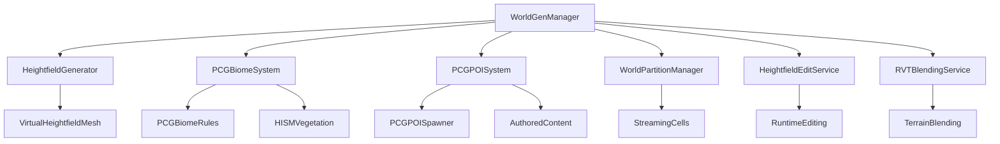

# World Generation Design Document

## Overview

The World Generation system creates a deterministic, heightfield-based procedural world using UE5's native systems. The system generates a persistent world with multiple biomes, points of interest (POIs), and streaming content that serves as the foundation for all other game systems. The design emphasizes performance, determinism, and seamless integration with UE5's PCG Framework, World Partition, and rendering systems.

## Architecture

### Core Components



### System Layers

1. **Management Layer**: WorldGenManager coordinates all world generation activities
2. **Generation Layer**: Heightfield and PCG systems handle terrain and content creation
3. **Streaming Layer**: World Partition manages content loading and unloading
4. **Rendering Layer**: VHM, RVT, and HISM handle efficient rendering

## Components and Interfaces

### IHeightfieldService
Manages heightfield creation, modification, and rendering.

**Key Methods:**
- `Initialize(FWorldGenSettings)`: Configure heightfield parameters
- `GenerateHeightfield(uint64 Seed, FIntVector2 ChunkCoord)`: Create terrain data
- `ModifyHeightfield(FVector Location, float Radius, float Strength)`: Runtime editing
- `GetHeightAtLocation(FVector2D WorldPos)`: Query terrain height
- `SaveHeightfieldModifications()`: Persist terrain changes

### IPCGWorldService
Handles PCG-based content generation and management.

**Key Methods:**
- `InitializePCGGraph(UPCGGraph* BiomeGraph)`: Setup PCG generation rules
- `GenerateBiomeContent(FIntVector2 ChunkCoord, EBiomeType Biome)`: Spawn biome-specific content
- `SpawnPOI(FVector Location, FPOIData POIData)`: Place points of interest
- `UpdateHISMInstances(FIntVector2 ChunkCoord)`: Manage instanced mesh performance
- `RemoveContentInArea(FBox Area)`: Clear content for modifications

### IWorldPartitionService
Manages streaming and authored content integration.

**Key Methods:**
- `RegisterStreamingCell(FIntVector2 CellCoord, ULevel* ContentLevel)`: Add authored areas
- `UpdatePlayerLocation(FVector PlayerPos)`: Trigger streaming updates
- `LoadCellAsync(FIntVector2 CellCoord)`: Stream in content
- `UnloadCellAsync(FIntVector2 CellCoord)`: Stream out content
- `GetLoadedCells()`: Query current streaming state

## Data Models

### FWorldGenSettings
Configuration structure for world generation parameters.

```cpp
struct FWorldGenSettings {
    uint64 Seed = 1337;
    int32 WorldGenVersion = 1;
    
    // Heightfield settings
    float HeightfieldScale = 100.0f;  // World units per heightfield texel
    int32 HeightfieldResolution = 1024;  // Texels per chunk
    float MaxTerrainHeight = 2000.0f;
    
    // Streaming settings
    int32 StreamingRadius = 8;  // Chunks around player
    int32 CellSize = 12800;  // World Partition cell size (128m)
    
    // PCG settings
    float VegetationDensity = 1.0f;
    float POIDensity = 0.1f;
    int32 MaxHISMInstances = 10000;  // Per chunk
    
    // Biome noise parameters
    float BiomeScale = 0.001f;
    float BiomeBlendDistance = 500.0f;  // Blend zone width
    
    // RVT settings
    int32 RVTResolution = 4096;
    int32 RVTTileSize = 256;
};
```

### FBiomeDefinition
Defines characteristics and generation rules for each biome.

```cpp
struct FBiomeDefinition {
    EBiomeType BiomeType;
    FString BiomeName;
    
    // Terrain properties
    float BaseHeight = 0.0f;
    float HeightVariation = 100.0f;
    UCurveFloat* HeightCurve;
    
    // PCG rules
    UPCGGraph* BiomePCGGraph;
    TArray<FPCGVegetationRule> VegetationRules;
    TArray<FPOISpawnRule> POIRules;
    
    // Visual properties
    UMaterialInterface* TerrainMaterial;
    FLinearColor RVTBlendColor;
    UTexture2D* BiomeMask;
};
```

### FHeightfieldModification
Represents a terrain modification for persistence.

```cpp
struct FHeightfieldModification {
    FVector2D Center;
    float Radius;
    float Strength;
    EHeightfieldOperation Operation;  // Add, Subtract, Flatten, Smooth
    FDateTime Timestamp;
    FIntVector2 AffectedChunk;
};
```

## Error Handling

### Heightfield Generation Failures
- Fallback to simplified noise generation
- Placeholder flat terrain for failed chunks
- Detailed logging with seed and chunk coordinates
- Graceful degradation to maintain gameplay

### PCG System Issues
- Validation of PCG graph availability
- Fallback to basic procedural spawning
- Error reporting for invalid PCG rules
- Performance monitoring for PCG generation times

### World Partition Streaming Issues
- Retry mechanism for failed cell loading
- Fallback content for missing authored areas
- Memory pressure detection and cell unloading
- Network-aware streaming for multiplayer

## Performance Considerations

### Heightfield Optimization
- GPU-based heightfield generation using compute shaders
- Texture streaming for large heightfield data
- LOD system for distant terrain rendering
- Efficient heightfield modification batching

### PCG Performance
- Partitioned PCG grids for incremental generation
- HISM culling and LOD management
- Async PCG generation to prevent frame drops
- Memory pooling for PCG-generated objects

### Streaming Performance
- Predictive loading based on player movement
- Priority-based cell loading (gameplay areas first)
- Background unloading of distant content
- Compressed storage for inactive cells

## Integration with UE5 Systems

### Virtual Heightfield Mesh (VHM)
- Height texture generation from procedural data
- Automatic LOD and culling integration
- Material blending through RVT sampling
- Collision mesh generation for gameplay

### PCG Framework Integration
- Runtime PCG graph execution
- Partitioned grid support for streaming
- Custom PCG nodes for biome-specific rules
- Integration with World Partition cells

### Runtime Virtual Texturing (RVT)
- Terrain material blending between biomes
- Foliage placement data sampling
- Dynamic decal application (paths, wear)
- Efficient texture memory usage

### World Partition Integration
- Authored content streaming (towns, dungeons)
- Automatic cell loading based on player proximity
- Integration with PCG-generated content
- Network replication support for multiplayer

## Debug and Development Tools

### Console Commands
- `wg.Seed <value>`: Change world generation seed
- `wg.StreamRadius <value>`: Adjust streaming radius
- `wg.ShowBiomes <bool>`: Toggle biome visualization
- `wg.ShowPCGDebug <bool>`: Display PCG generation info
- `wg.RegenChunk <x> <y>`: Regenerate specific chunk

### Visual Debug Features
- Biome boundary visualization
- PCG generation timing display
- Heightfield modification indicators
- World Partition cell boundaries
- HISM instance count display

### Performance Monitoring
- Heightfield generation timing
- PCG execution profiling
- Streaming performance metrics
- Memory usage tracking
- Frame time impact analysis