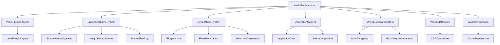

# Enhanced World Generation Design Document

## Overview

The Enhanced World Generation system transforms the existing voxel-based world into a Valheim-inspired earth-like procedural world using advanced noise algorithms and sophisticated biome systems. The system generates realistic geographical features including mountains, valleys, rivers, and coastal areas with visually distinct biomes that have unique materials, vegetation data, and height-based distribution. The design maintains the existing performance characteristics while adding configurable world boundaries and optional planet-like wrapping.

## Architecture

### Core Components



### System Layers

1. **Management Layer**: WorldGenManager coordinates all world generation activities
2. **Service Layer**: Specialized services handle specific aspects (editing, saving, biomes)
3. **Adapter Layer**: VoxelPluginAdapter abstracts the underlying voxel plugin
4. **Plugin Layer**: VoxelPluginLegacy provides core voxel functionality

## Components and Interfaces

### IVoxelWorldService
Manages world creation, streaming, and chunk management.

**Key Methods:**
- `Initialize(FWorldGenSettings)`: Configure world parameters
- `SetSeed(uint64, int32)`: Set deterministic seed and version
- `BuildWorldAsync(AActor*)`: Stream world around player anchor
- `TickStreaming(float)`: Update chunk loading/unloading
- `RebuildChunkAsync(FIntVector)`: Regenerate specific chunk

### IVoxelEditService
Handles runtime voxel modifications with CSG operations.

**Key Methods:**
- `ApplySphere(FVector, float, EVoxelCSG)`: Apply spherical brush operations
- `QueueAsyncRemesh(FIntVector)`: Schedule chunk remeshing after edits

### IVoxelSaveService
Manages persistence of voxel modifications using per-chunk append-only JSONL format.

**Key Methods:**
- `RecordOp(FVoxelEditOp)`: Log edit operations per chunk
- `FlushDirty()`: Write pending operations to disk (atomic writes)
- `LoadAndReplayForChunk(FIntVector)`: Restore chunk modifications after regen
- `CompactChunkFile(FIntVector)`: Optimize chunk file on unload

**File Format:**
- Per-chunk append-only JSONL files
- Write-behind timer (3 seconds) with atomic writes
- Compaction on chunk unload

### Enhanced Terrain Noise System
Generates earth-like terrain using advanced noise algorithms optimized for realistic geographical features.

**Noise Algorithm Selection:**
Based on research, the optimal approach for earth-like terrain combines:
- **Ridged Multifractal Noise**: Creates sharp mountain ridges and valley systems
- **Domain Warping**: Adds realistic erosion-like patterns and river meandering
- **Hydraulic Erosion Simulation**: Post-processes terrain for realistic water flow patterns
- **Gradient-based River Generation**: Uses flow accumulation to create natural river networks

**Terrain Features:**
- **Mountain Ranges**: Using ridged noise with high amplitude at elevation thresholds
- **Valley Systems**: Inverted ridged noise creates natural drainage patterns
- **River Networks**: Flow accumulation algorithms create realistic branching rivers
- **Coastal Areas**: Smooth transitions between land and water using distance fields

### Enhanced Biome System
Generates visually distinct biomes with unique materials, vegetation, and height-based distribution.

**Biome Types with Materials:**
- **Meadows**: Green grass material, gentle rolling hills, basic vegetation
- **BlackForest**: Dark forest material, dense terrain, coniferous trees
- **Swamp**: Muddy brown material, low-lying wetlands, marsh vegetation
- **Mountains**: Snow/rock material, above height threshold, alpine vegetation
- **Ocean**: Water material, below height threshold, aquatic vegetation

**Height-Based Biome Distribution:**
- **Mountain Threshold**: Configurable elevation (default: 200m) above which mountain biome dominates
- **Water Threshold**: Configurable elevation (default: -10m) below which ocean biome dominates
- **Transition Zones**: Smooth blending between height-based and noise-based biomes

**Material System:**
- Each biome has distinct material properties for visual differentiation
- Material blending in transition zones using weighted interpolation
- Support for texture atlasing and material parameter variation

**Blending Strategy:**
- Enhanced 24-meter blend zones with material-aware blending
- Height-based biomes override noise-based biomes in extreme elevations
- Smooth material transitions using distance-based interpolation
- All noise/biome RNG derived from seed-mixed PRNG (Seed ^ Hash(ChunkCoord) ^ FeatureTag)

### Vegetation System
Manages biome-specific vegetation data for future harvesting and crafting systems.

**Vegetation Data Structure:**
- **Tree Species**: Biome-specific tree types (Oak, Pine, Birch, etc.)
- **Foliage Types**: Undergrowth, bushes, grass varieties per biome
- **Resource Availability**: Harvestable materials and their spawn rates
- **Seasonal Variation**: Optional support for seasonal vegetation changes

**Biome Vegetation Profiles:**
- **Meadows**: Oak trees, berry bushes, wildflowers, basic crafting materials
- **BlackForest**: Pine/Spruce trees, mushrooms, dense undergrowth, advanced wood types
- **Swamp**: Willow trees, reeds, moss, unique swamp resources
- **Mountains**: Sparse alpine vegetation, rare minerals, hardy shrubs
- **Ocean**: Kelp, coral (if shallow), driftwood, marine resources

**Integration Points:**
- Vegetation data stored per chunk for future spawning systems
- Resource density maps for crafting system integration
- Biome-specific loot tables for harvesting mechanics

### World Boundary System
Manages configurable world size, shape, and optional planet-like wrapping.

**World Configuration:**
- **Size Limits**: Configurable world radius or rectangular bounds
- **Shape Options**: Circular, square, or custom polygon boundaries
- **Boundary Behavior**: Hard limits, fade zones, or seamless wrapping

**Planet-like Wrapping (Optional):**
- **Edge Visualization**: Distant terrain visible across world boundaries
- **Seamless Transitions**: Terrain continuity across wrapped edges
- **Coordinate Mapping**: Transform world coordinates for wrapped generation
- **Performance Optimization**: LOD management for wrapped terrain visibility

**Construction Script Integration:**
- **Editor Preview**: Immediate world generation without play mode
- **Parameter Validation**: Real-time validation of world configuration
- **VoxelPlugin Integration**: Seamless integration with existing voxel tools
- **Performance Monitoring**: Real-time generation performance feedback

## Data Models

### FWorldGenSettings
Enhanced configuration structure for world generation parameters.

```cpp
struct FWorldGenSettings {
    uint64 Seed = 1337;
    int32 WorldGenVersion = 2;  // Incremented for enhanced features
    FString PluginSHA = "";  // For determinism validation
    float VoxelSizeCm = 50.0f;
    int32 ChunkSize = 32;
    int32 MaxLOD = 3;
    int32 LOD0Radius = 2;  // Chunks with full detail + collision
    int32 LOD1Radius = 4;  // Chunks with collision
    int32 LOD2Radius = 6;  // Visual only chunks
    bool bCollisionUpToLOD1 = true;
    float BiomeBlendMeters = 24.0f;
    int32 SaveFlushMs = 3000;  // Auto-flush timer for edits
    
    // Enhanced terrain parameters
    float MountainHeightThreshold = 200.0f;  // Height above which mountains dominate
    float WaterHeightThreshold = -10.0f;     // Height below which water dominates
    float RidgedNoiseScale = 0.001f;         // Scale for ridged multifractal noise
    float DomainWarpStrength = 50.0f;        // Strength of domain warping
    bool bEnableRiverGeneration = true;      // Enable river network generation
    
    // World boundary settings
    float WorldRadius = 2000.0f;             // World size in meters
    EWorldShape WorldShape = EWorldShape::Circular;
    bool bEnableWorldWrapping = false;       // Planet-like wrapping
    float BoundaryFadeDistance = 100.0f;     // Distance for boundary fade
    
    // Biome material settings
    bool bUseBiomeMaterials = true;          // Enable distinct biome materials
    float MaterialBlendDistance = 12.0f;     // Distance for material blending
    
    // Legacy biome noise parameters (still used for base biome distribution)
    float MeadowsScale = 0.0025f;
    float BlackForestScale = 0.0030f;
    float SwampScale = 0.0020f;
};

enum class EWorldShape : uint8 {
    Circular,
    Square,
    Custom
};
```

### FVoxelEditOp
Represents a single voxel modification operation for persistence.

```cpp
struct FVoxelEditOp {
    FVector Center;
    float Radius;
    EVoxelCSG Operation;  // Add/Subtract
    FIntVector AffectedChunk;
    FDateTime Timestamp;
};
```

### FEnhancedBiomeData
Enhanced biome data structure with materials and vegetation information.

```cpp
struct FEnhancedBiomeData {
    FString BiomeName;
    float HeightOffset;
    float NoiseScale;
    float NoiseOctaves;
    
    // Material system
    TSoftObjectPtr<UMaterialInterface> BiomeMaterial;
    FLinearColor BiomeColor;  // Fallback color if no material
    float MaterialRoughness = 0.5f;
    float MaterialMetallic = 0.0f;
    
    // Vegetation data
    FVegetationProfile VegetationProfile;
    
    // Height-based biome properties
    bool bIsHeightBasedBiome = false;  // True for mountains/ocean
    float HeightThreshold = 0.0f;      // Elevation threshold for this biome
    bool bOverrideOtherBiomes = false; // True if this biome overrides noise-based biomes
    
    TArray<FPOISpawnRule> POIRules;
    FLinearColor DebugColor;
};

struct FVegetationProfile {
    // Tree species data
    TArray<FTreeSpeciesData> TreeSpecies;
    
    // Foliage types
    TArray<FFoliageTypeData> FoliageTypes;
    
    // Harvestable resources
    TArray<FResourceData> HarvestableResources;
    
    // Vegetation density
    float TreeDensity = 1.0f;
    float FoliageDensity = 1.0f;
    float ResourceDensity = 1.0f;
};

struct FTreeSpeciesData {
    FString SpeciesName;
    TSoftObjectPtr<UStaticMesh> TreeMesh;
    float SpawnProbability = 1.0f;
    FVector2D SizeRange = FVector2D(0.8f, 1.2f);
    TArray<FString> HarvestableResources;  // Wood types, etc.
};

struct FFoliageTypeData {
    FString FoliageTypeName;
    TSoftObjectPtr<UStaticMesh> FoliageMesh;
    float SpawnProbability = 1.0f;
    float DensityMultiplier = 1.0f;
};

struct FResourceData {
    FString ResourceName;
    FString ResourceType;  // "Wood", "Stone", "Plant", etc.
    float SpawnRate = 1.0f;
    int32 MinQuantity = 1;
    int32 MaxQuantity = 3;
};
```

## Advanced Noise Algorithms

### Ridged Multifractal Noise
Optimal for creating realistic mountain ranges and sharp terrain features.

**Implementation Details:**
- Uses absolute value of noise to create sharp ridges
- Multiple octaves with decreasing amplitude
- Lacunarity of 2.0 for natural frequency progression
- Persistence of 0.5 for balanced detail levels

**Mathematical Formula:**
```
ridged = 1.0 - abs(noise(x, y))
result = ridged * ridged  // Sharpen the ridges
```

### Domain Warping
Creates realistic erosion patterns and natural terrain variation.

**Implementation Strategy:**
- Generate two offset noise patterns for X and Y displacement
- Apply displacement to base terrain coordinates before sampling
- Use different scales for displacement vs. base terrain
- Strength parameter controls warping intensity

**Benefits:**
- Breaks up regular noise patterns
- Creates natural-looking erosion channels
- Adds organic variation to terrain features

### River Generation Algorithm
Uses flow accumulation to create realistic river networks.

**Process:**
1. Generate heightmap using ridged noise
2. Calculate flow direction for each point (steepest descent)
3. Accumulate flow values following drainage paths
4. Carve river channels where flow accumulation exceeds threshold
5. Apply smoothing to river channels for natural meandering

**Integration:**
- Rivers modify base terrain height
- River biomes override other biome types in channels
- Flow data stored for future water simulation systems

## Error Handling

### Chunk Generation Failures
- Single retry policy with exponential backoff
- Fallback to simplified terrain: heightmap-only plane with one octave noise
- Placeholder mesh for completely failed chunks
- Detailed logging with seed and chunk coordinates on every error
- Graceful degradation to maintain gameplay

### VoxelPlugin Integration Issues
- Validation of plugin availability at startup
- Error reporting for missing or incompatible plugin versions
- Fallback terrain generation without voxel features
- Clear error messages for developers

### Memory and Performance Issues
- Chunk unloading when memory pressure detected
- LOD reduction under performance stress
- Async operation cancellation during frame drops
- Configurable quality settings for different hardware

## Testing Strategy

### Determinism Testing
- Automated tests with fixed seeds for enhanced terrain algorithms
- Terrain height validation at key coordinates (±1cm tolerance) including ridged noise
- Biome material consistency verification across multiple runs
- River generation determinism testing
- Cross-platform determinism validation with enhanced noise functions
- Versioning validation using GeneratorVersion and PluginSHA

### Performance Testing
- Enhanced chunk generation timing with new noise algorithms
- Memory usage profiling with additional biome data structures
- Frame rate monitoring during world exploration with material blending
- Stress testing with rapid player movement across biome boundaries
- World boundary system performance testing
- Material streaming and blending performance validation

### Integration Testing
- VoxelPluginLegacy compatibility with enhanced features
- Construction script integration testing for immediate world preview
- Biome material system integration with rendering pipeline
- Vegetation data system integration testing
- World boundary and wrapping system validation
- Height-based biome override testing

### Visual Testing
- Biome material distinctiveness validation
- Terrain realism assessment (mountains, valleys, rivers)
- Material blending quality inspection
- World boundary visual continuity testing
- Planet wrapping visual validation (if enabled)
- River network natural appearance verification

## Performance Considerations

### Streaming Optimization
- Prioritized chunk loading based on player proximity
- Amortized chunk generation (≤5ms average build time, log rolling P95 for spikes)
- ≤64MB mesh memory within stream radius
- ≤8000 triangles at LOD0 per chunk
- No collision past LOD1
- Intelligent LOD management for distant chunks
- Async operations to prevent frame drops

### Memory Management
- Chunk unloading beyond streaming radius
- Compressed storage for inactive chunk data
- Efficient voxel edit operation storage
- Garbage collection optimization for large worlds

### Rendering Optimization
- LOD-based mesh complexity reduction
- Frustum culling for distant chunks
- Occlusion culling for underground areas (optional/experimental)
- Batch rendering for similar voxel materials

## Debug and Development Tools

### Console Commands
- `wg.Seed <value>`: Change world generation seed
- `wg.StreamRadius <value>`: Adjust streaming radius
- `wg.DebugMasks <bool>`: Toggle biome mask visualization
- `wg.DebugChunks <bool>`: Show chunk boundaries and LOD levels

### Visual Debug Features
- Biome mask overlay rendering
- Chunk boundary wireframes
- POI placement validation indicators
- Performance metrics display (chunk build times, memory usage)

### Logging System
- Dedicated LogWorldGen category
- Seed and chunk coordinates included on every error
- Rolling mean/P95 build-time logging every 2 seconds
- Performance timing logs for optimization
- Edit operation audit trail for debugging