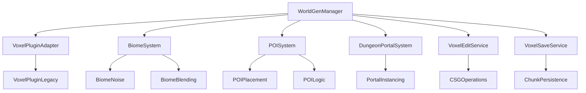

# World Generation Design Document

## Overview

The World Generation system creates a deterministic, voxel-based procedural world using the VoxelPluginLegacy. The system generates a persistent world with multiple biomes, points of interest (POIs), and dungeon portals that serve as the foundation for all other game systems. The design emphasizes performance, determinism, and seamless integration with Unreal Engine 5's streaming and rendering systems.

## Architecture

### Core Components



### System Layers

1. **Management Layer**: WorldGenManager coordinates all world generation activities
2. **Service Layer**: Specialized services handle specific aspects (editing, saving, biomes)
3. **Adapter Layer**: VoxelPluginAdapter abstracts the underlying voxel plugin
4. **Plugin Layer**: VoxelPluginLegacy provides core voxel functionality

## Components and Interfaces

### IVoxelWorldService
Manages world creation, streaming, and chunk management.

**Key Methods:**
- `Initialize(FWorldGenSettings)`: Configure world parameters
- `SetSeed(uint64, int32)`: Set deterministic seed and version
- `BuildWorldAsync(AActor*)`: Stream world around player anchor
- `TickStreaming(float)`: Update chunk loading/unloading
- `RebuildChunkAsync(FIntVector)`: Regenerate specific chunk

### IVoxelEditService
Handles runtime voxel modifications with CSG operations.

**Key Methods:**
- `ApplySphere(FVector, float, EVoxelCSG)`: Apply spherical brush operations
- `QueueAsyncRemesh(FIntVector)`: Schedule chunk remeshing after edits

### IVoxelSaveService
Manages persistence of voxel modifications using per-chunk append-only JSONL format.

**Key Methods:**
- `RecordOp(FVoxelEditOp)`: Log edit operations per chunk
- `FlushDirty()`: Write pending operations to disk (atomic writes)
- `LoadAndReplayForChunk(FIntVector)`: Restore chunk modifications after regen
- `CompactChunkFile(FIntVector)`: Optimize chunk file on unload

**File Format:**
- Per-chunk append-only JSONL files
- Write-behind timer (3 seconds) with atomic writes
- Compaction on chunk unload

### BiomeSystem
Generates and blends multiple biome types using noise functions.

**Biome Types:**
- **Meadows**: Gentle rolling hills, basic resources
- **BlackForest**: Dense terrain, elevated areas
- **Swamp**: Low-lying, flat wetland areas

**Blending Strategy:**
- Use Perlin noise masks for each biome with normalized weights
- 24-meter blend zones between biomes (measured in world units)
- When three biomes overlap, max-weight wins
- Height offsets applied after blend calculation
- All noise/POI RNG derived from seed-mixed PRNG (Seed ^ Hash(ChunkCoord) ^ FeatureTag)

### POISystem
Places pre-built structures with embedded logic throughout the world.

**Placement Rules:**
- Minimum 150m spacing between POIs
- Slope validation (<20 degrees)
- Altitude band restrictions per POI type
- Stamp order: terrain flatten → place prefab → resolve overlaps by skipping
- 5 retry attempts before skipping placement
- Minimum waterline clearance for applicable POIs

### DungeonPortalSystem
Creates portal entry points that transport players to pre-built dungeon areas.

**Portal Mechanics:**
- Portals placed as special POI types
- Teleport to a fixed sub-level (no per-instance world state in MVP)
- Simple level transition without complex instancing

## Data Models

### FWorldGenSettings
Configuration structure for world generation parameters.

```cpp
struct FWorldGenSettings {
    uint64 Seed = 1337;
    int32 WorldGenVersion = 1;
    FString PluginSHA = "";  // For determinism validation
    float VoxelSizeCm = 50.0f;
    int32 ChunkSize = 32;
    int32 MaxLOD = 3;
    int32 LOD0Radius = 2;  // Chunks with full detail + collision
    int32 LOD1Radius = 4;  // Chunks with collision
    int32 LOD2Radius = 6;  // Visual only chunks
    bool bCollisionUpToLOD1 = true;
    float BiomeBlendMeters = 24.0f;
    int32 SaveFlushMs = 3000;  // Auto-flush timer for edits
    
    // Biome noise parameters
    float MeadowsScale = 0.0025f;
    float BlackForestScale = 0.0030f;
    float SwampScale = 0.0020f;
};
```

### FVoxelEditOp
Represents a single voxel modification operation for persistence.

```cpp
struct FVoxelEditOp {
    FVector Center;
    float Radius;
    EVoxelCSG Operation;  // Add/Subtract
    FIntVector AffectedChunk;
    FDateTime Timestamp;
};
```

### FBiomeData
Defines characteristics and generation parameters for each biome.

```cpp
struct FBiomeData {
    FString BiomeName;
    float HeightOffset;
    float NoiseScale;
    float NoiseOctaves;
    TArray<FPOISpawnRule> POIRules;
    FLinearColor DebugColor;
};
```

## Error Handling

### Chunk Generation Failures
- Single retry policy with exponential backoff
- Fallback to simplified terrain: heightmap-only plane with one octave noise
- Placeholder mesh for completely failed chunks
- Detailed logging with seed and chunk coordinates on every error
- Graceful degradation to maintain gameplay

### VoxelPlugin Integration Issues
- Validation of plugin availability at startup
- Error reporting for missing or incompatible plugin versions
- Fallback terrain generation without voxel features
- Clear error messages for developers

### Memory and Performance Issues
- Chunk unloading when memory pressure detected
- LOD reduction under performance stress
- Async operation cancellation during frame drops
- Configurable quality settings for different hardware

## Testing Strategy

### Determinism Testing
- Automated tests with fixed seeds
- Terrain height validation at key coordinates (±1cm tolerance)
- POI placement consistency verification
- Cross-platform determinism validation with specific noise function precision
- Versioning validation using GeneratorVersion and PluginSHA

### Performance Testing
- Chunk generation timing benchmarks
- Memory usage profiling during streaming
- Frame rate monitoring during world exploration
- Stress testing with rapid player movement

### Integration Testing
- VoxelPluginLegacy compatibility verification
- Save/load cycle testing for voxel edits
- Biome transition smoothness validation
- POI placement rule enforcement testing

### Manual Testing
- Visual inspection of biome transitions
- POI accessibility and logic functionality
- Dungeon portal transportation testing
- World exploration for seam detection

## Performance Considerations

### Streaming Optimization
- Prioritized chunk loading based on player proximity
- Amortized chunk generation (≤5ms average build time, log rolling P95 for spikes)
- ≤64MB mesh memory within stream radius
- ≤8000 triangles at LOD0 per chunk
- No collision past LOD1
- Intelligent LOD management for distant chunks
- Async operations to prevent frame drops

### Memory Management
- Chunk unloading beyond streaming radius
- Compressed storage for inactive chunk data
- Efficient voxel edit operation storage
- Garbage collection optimization for large worlds

### Rendering Optimization
- LOD-based mesh complexity reduction
- Frustum culling for distant chunks
- Occlusion culling for underground areas (optional/experimental)
- Batch rendering for similar voxel materials

## Debug and Development Tools

### Console Commands
- `wg.Seed <value>`: Change world generation seed
- `wg.StreamRadius <value>`: Adjust streaming radius
- `wg.DebugMasks <bool>`: Toggle biome mask visualization
- `wg.DebugChunks <bool>`: Show chunk boundaries and LOD levels

### Visual Debug Features
- Biome mask overlay rendering
- Chunk boundary wireframes
- POI placement validation indicators
- Performance metrics display (chunk build times, memory usage)

### Logging System
- Dedicated LogWorldGen category
- Seed and chunk coordinates included on every error
- Rolling mean/P95 build-time logging every 2 seconds
- Performance timing logs for optimization
- Edit operation audit trail for debugging